# GuardianMesh AI - Complete Project Report

Verified 07 September 2026. Companion to the 54-page PDF.


## Complete project report - GuardianMesh AI

Autonomous Cyber Resilience for Critical Infrastructure
MENA Ignite Hackathon 2026 - GSMA × Nokia
Smart Cities, Urban Safety & Mega-Project Infrastructure
An evidence-based account of the current repository and running local prototype. Includes actual UI captures, six-agent logic, graph risk, approval decisions, incident records, tests, production build and a complete judge rehearsal.
Scope: IMPLEMENTED deterministic software + SIMULATED telecom effects. No real Nokia/CAMARA carrier execution, external LLM or authorized carrier sandbox is claimed.
Verification date: 07 September 2026. Repository has no commits; source hashes and captured evidence identify the reviewed state.


## Reading guide - Contents

28 requested sections; code-backed descriptions, readable evidence, and a final Definition of Done.
Evidence convention: S01-S29 refer to original PNG captures in docs/report-assets. Captions identify the incident and the specific state. Crops enlarge genuine screenshots; they do not alter application data.
All times in evidence tables use UTC. UI clocks use the browser locale (Asia/Hebron during capture). Test stdout was captured directly from the shell; it is typeset as a transcript, not a fabricated terminal screenshot.


## 01 / Executive overview - Defend the service, contain the source


GuardianMesh demonstrates a closed defensive workflow for connected city infrastructure. The objective is to contain a compromised endpoint while maintaining connectivity for hospitals, emergency response, energy, traffic management, public safety and city control.
Problem and target users
IoT, edge compute and telecom dependencies can connect a low-value endpoint to a high-consequence service. A security analyst, city operations lead or telecom service operator needs to see those dependencies before applying containment. The prototype makes that operational consequence visible in one command center.
What the local prototype contributes
Six deterministic logical agents share a typed incident context. They inspect synthetic observations, explain a focused MITRE classification, traverse the dependency graph, order service-preserving actions, enforce policy and generate a traceable report. Network capabilities become a modeled defense actuator rather than only a source of alerts.
| Stage | Observed implementation |
| --- | --- |
| Attack → detection | Synthetic camera sessions exceed the explicit Sentinel threshold. |
| Classification → impact | T1210 and the camera-to-hospital dependency path appear; peak risk is 80/100. |
| Plan → policy → approval | Routes and QoD precede isolation. Energy shared-segment actions require a decision. |
| Network defense → containment | Local provider results mutate the twin; source isolation removes all attack paths. |
| Service continuity → report | Six operational services remain reachable; reports preserve decisions and measurements. |
Hackathon context comes from the project brief: MENA Ignite 2026, GSMA × Nokia, Smart Cities / Urban Safety / Mega-Project Infrastructure. This report does not assert vendor certification, event endorsement or a live operator relationship.


## 02 / Current project status - Implementation matrix 1 of 2

Implementation labels describe software scope; verification describes actual evidence.
| Feature | Implementation | Location in code | How verified | Notes / limitations |
| --- | --- | --- | --- | --- |
| Frontend command center | IMPLEMENTED | frontend/src/App.tsx; frontend/src/components/ | Live application screenshots; 11 frontend tests; production build passed. | React interface renders incident snapshots; primary assets and fonts are local. |
| FastAPI backend | IMPLEMENTED | backend/app/main.py:create_app | health.json, openapi.json, Swagger screenshot; API tests passed. | Local REST controls and validation; no production authentication or multi-tenant isolation. |
| SQLite database | IMPLEMENTED | backend/app/persistence.py:Repository and five row models | database.json captures actual tables, schema and stored records. | SQLAlchemy stores JSON evidence in five tables; SQLite file remains local. |
| Live WebSockets | IMPLEMENTED | backend/app/main.py:stream; frontend/src/useGuardian.ts | websocket-runtime.json records SNAPSHOT updates, PONG, containment and report completion. | Full snapshots, sequence guard and reconnect; slow-client queues coalesce without discarding timeline evidence. |
| Interactive digital twin | IMPLEMENTED | frontend/src/components/Topology.tsx; backend/app/topology.py | Idle, attack, hospital inspector, protected-route and isolated-camera screenshots. | Selectable assets, pan/zoom and backend-driven state; schematic topology is a simulation. |
| 14-node topology | IMPLEMENTED | backend/app/topology.py:build_topology | topology.json: 14 assets, 21 links, six critical services; topology tests passed. | Six protected core routes begin disabled; management links do not propagate threats. |
| Six coordinated agents | IMPLEMENTED | backend/app/agents.py; backend/app/engine.py:run | Camera, identity and approved-energy evidence records contain six COMPLETE agent states. | Six deterministic logical agents exchange typed incident context; no LLM calls. |
| Sentinel agent | IMPLEMENTED | backend/app/agents.py:SentinelAgent.inspect | Telemetry rule tests; classification screenshot and actual scenario classifications. | Numeric/boolean rules reject benign or ambiguous evidence; confidence indicators are fixed, uncalibrated. |
| Impact agent | IMPLEMENTED | backend/app/agents.py:ImpactAgent.analyze; backend/app/risk.py | Camera hospital exposure 80/100; directed-path, cycle and isolation tests. | Computes graph exposure from scenario severity and current topology; no empirical outage prediction. |
| Response agent | IMPLEMENTED | backend/app/agents.py:ResponseAgent.plan | Camera and identity execute 11 actions; approved energy seven; rejection fallback six. | Protects affected routes before isolation; operator rejection creates a separately reviewed plan version. |
| Compliance agent | IMPLEMENTED | backend/app/agents.py:ComplianceAgent.validate; backend/app/policies.py | Approval screenshots and policy tests cover hard rejection, ordering and shared-segment gates. | Runs operational safety rules against an independent twin copy before execution. |
| Network agent | IMPLEMENTED | backend/app/agents.py:NetworkAgent.execute; backend/app/provider.py | Actual action results and network screenshots; deterministic idempotency tests passed. | Executes through the local simulated provider; engine applies returned effects to the twin. |
| Report agent | IMPLEMENTED | backend/app/agents.py:ReportAgent.generate; backend/app/reporting.py | Executive and technical screenshots; incident report payloads and report/recovery tests. | Derives both reports from stored incident evidence, approvals, actions and continuity samples. |
| MITRE ATT&CK mapping | IMPLEMENTED | backend/app/agents.py:SentinelAgent; backend/app/scenarios.py:SCENARIOS | Scenario records map camera T1210, identity T1451 and energy T1489; mapping tests passed. | Focused three-technique coverage; identity is Mobile, other scenarios Enterprise; no complete ATT&CK knowledge base. |
| Graph impact analysis | IMPLEMENTED | backend/app/risk.py:calculate_impact | Hospital path retained in camera evidence; directional, disconnected, cyclic and maximum-path tests. | Traverses enabled simple threat paths; retains maximum score per destination. |
| Explainable risk scoring | IMPLEMENTED | backend/app/risk.py:calculate_impact and risk_band | Camera initial risk 80; contained residual risk zero; factor and risk-band tests. | Weighted heuristic combines severity, criticality, exposure, distance, link weights and protection. |
| Policy engine | IMPLEMENTED | backend/app/policies.py:validate_plan; backend/app/topology.py:continuity_verified | Tests reject critical-service isolation, live providers, unsafe ordering and shared-scope bypasses. | Hard rejections cannot be overridden; connectivity is checked separately from asset cyber-risk state. |


## 02 / Current project status - Implementation matrix 2 of 2

Implementation labels describe software scope; verification describes actual evidence.
| Feature | Implementation | Location in code | How verified | Notes / limitations |
| --- | --- | --- | --- | --- |
| Network-as-Code provider | SIMULATED | backend/app/provider.py:NetworkProvider and SimulatedNetworkProvider | Provider tests and action results show simulated=true with incident/action idempotency. | Interface plus local implementation; no carrier sockets, credentials or production Nokia integration. |
| CAMARA/Nokia-inspired operations | SIMULATED | backend/app/provider.py:ENDPOINTS and execute; backend/app/engine.py | Location, SIM-swap, rerouting, QoD and isolation results; hospital inspector shows eight milliseconds. | Paths are internal conceptual labels, not REST routes; 45-to-8-ms QoD is synthetic. |
| Human approval flow | IMPLEMENTED | backend/app/engine.py:approve and approval; frontend/src/components/Panels.tsx | Manual approval/rejection screenshots and persisted OPERATOR decisions; gate/race tests passed. | Plan/version-bound decision precedes all network actions; demo auto-approval explicitly records DEMO_AUTOMATION. |
| Incident timeline | IMPLEMENTED | backend/app/engine.py:emit; frontend/src/components/Panels.tsx:TimelinePanel | Captured ordered event payloads and live timeline; WebSocket sequence evidence. | Timestamped agent/control/action events persist before publication; screenshots may include deliberate documentation pauses. |
| Deterministic scenario engine | IMPLEMENTED | backend/app/engine.py:SimulationEngine; backend/app/scenarios.py | Three complete scenario traces; repeat-run, cancellation, overlapping-run and recovery tests. | One active run per process; findings and action order deterministic, identifiers and elapsed times variable. |
| Scenario 1: compromised IoT camera | SIMULATED | backend/app/scenarios.py:camera; backend/app/agents.py | camera-guided-final.json and screenshots: 11 actions, six agents complete, minimum six services online. | Synthetic exploit telemetry leads to T1210, hospital risk, route protection, QoD and camera isolation. |
| Scenario 2: telecom identity risk | SIMULATED | backend/app/scenarios.py:identity; backend/app/provider.py | identity-final.json and screenshots: T1451, context checks, 11 actions and six services online. | Recent SIM swap plus unconfirmed ownership and location mismatch; suspected identity takeover, synthetic telemetry. |
| Scenario 3: energy/city control | SIMULATED | backend/app/scenarios.py:energy; backend/app/engine.py:approval | Approved-energy and rejection reports/screenshots show seven/six actions respectively and retained six-service continuity. | T1489 targets the compute layer; rejection preserves the shared edge and retains both plan versions. |
| Guided Demo and controls | IMPLEMENTED | frontend/src/App.tsx; frontend/src/useGuardian.ts; backend/app/engine.py:control | Guided camera evidence records pause/resume/skip; restart and reset screenshots; lifecycle tests passed. | Five-second steps; pause freezes progression, skip advances timing only, restart creates a fresh incident. |
| Fast Pitch Mode | IMPLEMENTED | backend/app/engine.py:start; frontend/src/App.tsx | Clean, attack, middle and final Fast Pitch screenshots; scenario engine timing configuration inspected. | Default 1.7-second steps; total wall time depends on execution, approval and operator interaction. |
| Executive and technical reports | IMPLEMENTED | backend/app/reporting.py; frontend/src/components/Reports.tsx; backend/app/main.py:report | Actual report screenshots, saved payloads, frontend rendering tests and API JSON attachment tests. | History, executive summary, technical JSON, export and browser print; generated after verified containment. |
| Persistence and recovery | IMPLEMENTED | backend/app/persistence.py:save, list and recover | Database capture; history ordering, interrupted-run and contained-report recovery tests passed. | Reset retains report evidence; unfinished runs become INTERRUPTED after restart, never silently resume execution. |
| Automated tests and production build | IMPLEMENTED | backend/tests/; frontend/src/*test*; frontend/package.json | Backend: 59 passed, 33.88s; frontend: 11 passed, 2.15s; build: passed, 7.26s. | Two backend dependency deprecation warnings; zero failures/skips; production build emitted no warnings. |
| Docker delivery | PARTIAL | compose.yaml; backend/Dockerfile; frontend/Dockerfile; frontend/nginx.conf | Compose, Dockerfiles, proxy settings and volume configuration inspected; Docker CLI unavailable. | Configuration is present; container image builds, health checks and compose runtime were not executed. |
| README and startup instructions | IMPLEMENTED | README.md; scripts/setup.ps1; scripts/start.ps1; scripts/stop.ps1 | README describes actual startup URLs, scenarios, architecture, simulation scope and validation commands. | Windows helpers and manual commands supplied; dependencies require internet on first installation. |
| Optional LLM adapter | OPTIONAL - NOT IMPLEMENTED | backend/app/agents.py: deterministic implementations only | Inspected agent and engine code: no LLM client, adapter, model endpoint or key requirement. | Future extension only; the complete primary demo uses local deterministic rules. |
No mandatory local-demo feature failed the completed checks. Docker runtime remains PARTIAL. Optional LLM and production integrations remain unimplemented. All existing application code was preserved during this documentation run; additions are evidence and report builders.


## 03 / Project architecture - One incident context, one coherent defense

The diagram represents actual module relationships, not a proposed distributed deployment.
The engine calls the agents and applies provider results to Incident.topology. Each emit persists state before publishing a full snapshot. The frontend renders that backend state; it does not run a separate scripted attack animation.


## 03 / Project architecture - Repository map and module responsibilities


| Location | Important names and responsibility |
| --- | --- |
| backend/app/main.py | create_app, JsonFormatter: application lifecycle, REST, origin checks, WebSocket reader and sender cleanup. |
| backend/app/engine.py | SimulationEngine: start/run/control/approve, timed gates, emit/publish, final checks and safe shutdown. |
| models.py + scenarios.py | Pydantic schemas; frozen Scenario catalog; scenario_telemetry returns deterministic observations. |
| topology.py + risk.py | build_topology, protect, isolate, continuity_verified; calculate_impact and risk_band. |
| agents.py + policies.py | Six agent classes; validate_plan dry-runs ordered actions against a deep-copied twin. |
| provider.py + reporting.py | NetworkProvider protocol, SimulatedNetworkProvider, ENDPOINTS; generate_report from actual Incident. |
| persistence.py | Repository; IncidentRow, EventRow, ActionRow, ApprovalRow, ReportRow; SQLAlchemy sessions. |
| frontend/src/App.tsx | Header, mode/scenario controls, service continuity, twin, incident and report dialog orchestration. |
| useGuardian.ts + api.ts | Initialization/restore, controls, reconnecting WebSocket; request and applySnapshot helpers. |
| components/ | Topology.tsx: React Flow and asset inspector. Panels.tsx: agents/actions/timeline/risk. Reports.tsx: executive/JSON/history views. |
| styles.css + polish.css | Responsive layout, state colors, presentation styles. Assets and fonts for the primary demo are local. |
| tests / scripts / deployment | backend/tests and frontend *.test.*; setup/start/stop.ps1; Dockerfiles, nginx.conf and compose.yaml. |
Git inspection: master has no commits and the current source is untracked. A blank git diff therefore does not mean an empty implementation. source-manifest.json records SHA-256 hashes of reviewed files. Installed dependencies, SQLite and process logs are ignored.


## 04 / Actual data model - The shared Incident is the integration boundary


| Actual model | Important fields / purpose |
| --- | --- |
| Incident | id, scenario_id, title, source, started_at, ended_at, status, phase, mode, auto_approve, step_duration; owns all following evidence. |
| Asset / Link / Topology | Asset: criticality, exposure, protection, state, operational, latency_ms, x/y. Link: source/target, kind/weight, enabled, propagates_threat, carries_service, state. Topology holds both lists. |
| Telemetry | remote_sessions, baseline_sessions, exploit_signature, sim_swap_minutes_ago, ownership_confirmed, location_matches, service_stop_requests, maintenance_window. |
| Technique / Classification | Technique ID/name/tactic/domain/explanation/url; threat_type, confidence, source, evidence and reasoning. |
| AssetRisk / Impact | Per node: score, distance, path, critical flag, factors. Aggregate: score, severity, impacted, critical_services, propagation_path, explanation. |
| Action / Plan | Action id/kind/target/endpoint/rationale/expected_effect/status/result/executed_at. Plan id/version/strategy/rationale/ordered actions. |
| PolicyDecision / PolicyReview | Decision APPROVED / APPROVAL_REQUIRED / REJECTED; reasons and rules. Review binds a result to plan ID/version and timestamp. |
| Approval | plan_id, plan_version, decision APPROVE/REJECT, actor OPERATOR/DEMO_AUTOMATION, timestamp. |
| AgentState / TimelineEvent | Name/role/state/finding; event seq/timestamp/type/agent/message. Actual event model is TimelineEvent. |
| ServiceSample / Report | Sample step/online/risk/latency. Report generated_at plus executive and technical dictionaries. |


## 04 / Actual data model - How information moves between agents


| Producer | Writes shared state | Next consumer |
| --- | --- | --- |
| Scenario engine | Telemetry + compromised source + fresh Topology | SentinelAgent.inspect |
| Sentinel | Classification: rule evidence, technique and explanation | Impact / UI / Report |
| Impact | Impact: downstream nodes, risk factors and critical paths | ResponseAgent.plan |
| Response | Plan + immutable plan_history version | ComplianceAgent.validate |
| Compliance | PolicyDecision + plan-bound PolicyReview; Approval when required | Execution gate / fallback planning |
| Network | Executed Action records + twin mutation + residual_impact | Continuity verification / Report |
| Report | Executive and technical evidence dictionaries | UI, REST export, SQLite history |
Lifecycle and validation
A run begins RUNNING at ATTACK. Timed phases are DETECT, CLASSIFY, IMPACT, PLAN, POLICY, NETWORK, CONTAINED and COMPLETE. PAUSED suspends timed execution. AWAITING_APPROVAL freezes the plan before network actions. RESET restores the baseline twin; FAILED stops safely; INTERRUPTED marks a run whose backend execution cannot be resumed after restart.
Schema forbids extra fields. Pydantic constrains numeric ranges, scenario modes, action kinds, security states and approval actors. StartRequest accepts step_duration from 0.01 to 10 seconds. Report dictionaries and Action.result remain flexible JSON dictionaries; their individual fields are not all separately declared Pydantic schemas.
Execution is intentionally single-process: one active task and an asyncio lock prevent overlapping starts and inconsistent control changes. Plan history stores deep copies, so rejecting version 1 does not erase the decision that led to version 2.


## 05 / Digital twin - A complete city, ready to defend

S01 · Actual NORMAL / IDLE topology. Fourteen nodes; all six critical services are operational.
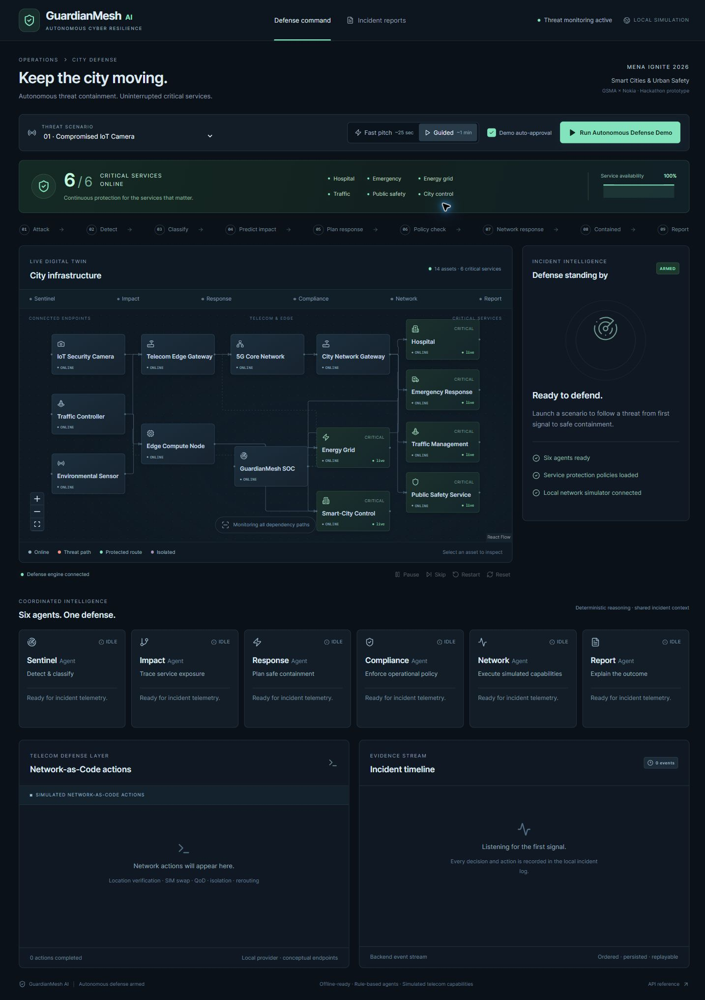


## 05 / Digital twin - Every node and every dependency category


| Node ID / name | Zone | Criticality / exposure | Critical |
| --- | --- | --- | --- |
| camera / IoT Security Camera | hospital-zone | 0.45 / 0.95 | No |
| traffic / Traffic Controller | city-zone | 0.70 / 0.80 | No |
| sensor / Environmental Sensor | city-zone | 0.35 / 0.75 | No |
| telecom / Telecom Edge Gateway | access-zone | 0.80 / 0.70 | No |
| edge / Edge Compute Node | energy-zone | 0.85 / 0.60 | No |
| core / 5G Core Network | core-zone | 0.95 / 0.45 | No |
| city / City Network Gateway | city-zone | 0.90 / 0.60 | No |
| guardian / GuardianMesh SOC | security-zone | 1.00 / 0.10 | No |
| hospital / Hospital | hospital-zone | 1.00 / 0.85 | Yes |
| emergency / Emergency Response | emergency-zone | 1.00 / 0.80 | Yes |
| energy / Energy Grid | energy-zone | 1.00 / 0.80 | Yes |
| traffic_center / Traffic Management | city-zone | 0.90 / 0.75 | Yes |
| safety / Public Safety Service | city-zone | 0.95 / 0.80 | Yes |
| control / Smart-City Control | city-zone | 0.95 / 0.80 | Yes |
Primary routes: camera/sensor → telecom → core → city → six services; traffic → edge → energy/control. Guardian → core/edge are management links. Six disabled protected links lead directly from core to each critical service and activate on reroute.
Node states: ONLINE, WARNING, COMPROMISED, AT_RISK, PROTECTED, ISOLATED, OFFLINE. Edge states: NORMAL, THREAT, PROTECTED, BLOCKED. Risk state and operational availability are separate. Editing, connecting and dragging nodes are disabled; inspection, pan/zoom and Fit View are enabled.


## 06 / Six-agent system - Sentinel, Impact and Response

All six agents are deterministic Python logic. No external LLM calls are made.
SentinelAgent.inspect
Purpose: detect and classify. Input: Incident.telemetry and source. Logic: exactly one explicit correlated telemetry rule must match; normal or ambiguous observations raise ValueError. Output: Classification with three evidence statements, a focused technique and rule confidence. Camera role: 48 sessions versus baseline 2 plus exploit signature supports attempted T1210 lateral movement. The match is observation-driven rather than selected only by scenario label.
ImpactAgent.analyze
Purpose: expose downstream service risk. Input: current topology, source and scenario severity. Logic: calls calculate_impact over enabled propagating simple paths, retaining maximum per-node scores. Output: Impact, critical service IDs and a selected path. Camera role: identifies Hospital at distance 4 with risk 80 and six critical services exposed. It runs again after isolation to establish residual risk 0.
ResponseAgent.plan
Purpose: produce safe ordered actions. Input: impact critical_services, source and scenario approval flag. Logic: deterministic rule/template selection; context checks, reroutes, priority QoD, optional shared-segment isolation, then endpoint quarantine. Output: versioned Plan with rationale and expected effects. Camera role: eleven actions protect all six services and hospital/emergency latency before isolating the camera. This is not a scored search over competing strategies.


## 06 / Six-agent system - Compliance, Network and Report


ComplianceAgent.validate
Purpose: guard operational safety. Input: current Plan, Incident and provider.simulated. Logic: validate_plan executes a dry-run on a deep copy, validates targets and capability labels, rejects critical-service isolation and broken routes, and requires approval for shared infrastructure. Output: PolicyDecision plus retained policy review. Camera role: APPROVED because endpoint isolation follows route protection. Energy role: WAITING for a plan-bound operator decision.
NetworkAgent.execute
Purpose: dispatch the approved action. Input: Action and Incident. Logic: await provider.execute, with idempotency in SimulatedNetworkProvider. Output: explicit simulated result. The engine applies reroute/protection, latency or isolation to the digital twin and emits an evidence event. Camera role: eleven actions including six protected routes, two QoD sessions and camera quarantine. This wrapper does not contact a carrier.
ReportAgent.generate
Purpose: explain the outcome. Input: the completed Incident, timeline, telemetry, plans, policy/approval history, executed actions and samples. Logic: generate_report derives both report dictionaries; no fixed placeholder incident is inserted. Output: Report. Camera role: records 80 → 0 risk, minimum six services online, eleven actions and measured containment duration. Report agent is marked COMPLETE before the report evidence is constructed.
Agent UI states are IDLE, ANALYZING, COMPLETE, WAITING and EXECUTING. States represent the current deterministic phase; they do not imply separate processes, machine-learning models or concurrent autonomous negotiations.


## 06 / Six-agent system - Agents visibly process actual incident state


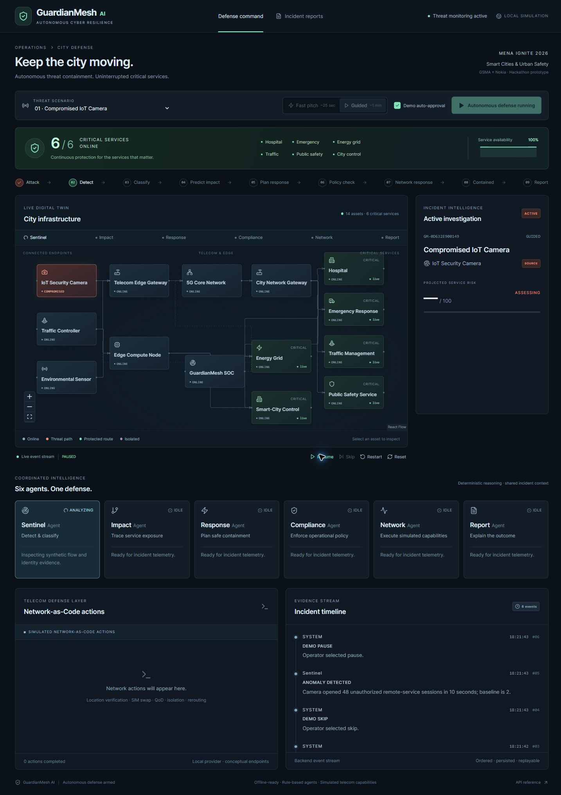
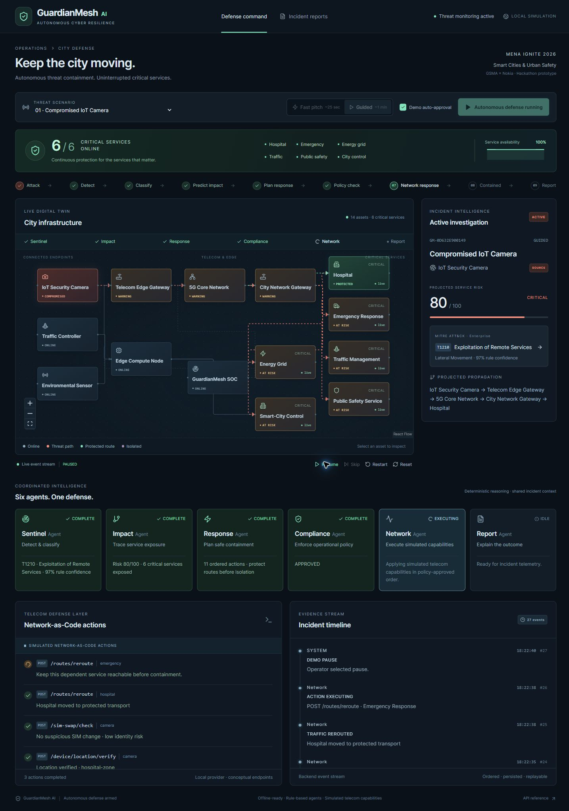
The compact six-agent strip above the twin mirrors these detailed cards. In Fast Pitch, the strip stays with the visual attack story; the full cards supply explainable findings below it. The backend agent list and the frontend DOM agreed in captured states.


## 07 / MITRE ATT&CK - Three focused, explainable mappings


| Scenario / technique | Actual detection rule and explanation |
| --- | --- |
| Camera · T1210; Exploitation of Remote Services; Enterprise / Lateral Movement | remote_sessions > 5 × baseline_sessions AND exploit_signature. 48 > 10 and signature=true. Exploit attempts support lateral movement; high volume alone is insufficient. |
| Identity · T1451; SIM Card Swap; Mobile / Initial Access | Swap within 1,440 minutes AND unconfirmed ownership AND location mismatch. The 12-minute swap is correlated with identity anomalies; a legitimate SIM change alone is not proof. |
| Energy · T1489; Service Stop; Enterprise / Impact | At least 10 service-stop requests AND outside maintenance. There are 26 synthetic requests. This is a compute-layer Enterprise mapping, not an ICS threat model. |
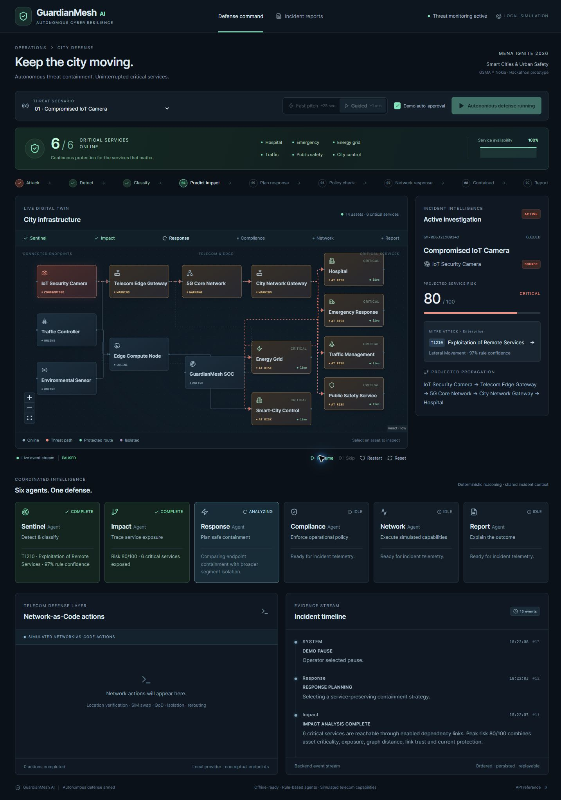
Confidence values 97%, 91% and 98% are fixed rule indicators, not empirically calibrated probabilities. Only these three focused mappings are implemented; no full ATT&CK knowledge base or live threat feed is claimed.


## 08 / Impact analysis - The hospital risk is calculated from the graph


```text
score = round(100 * severity
  * (0.55 * criticality + 0.25 * exposure
     + 0.20 / (1 + 0.2 * distance))
  * product(edge weights) * (1 - protection))
```
calculate_impact builds directed outgoing adjacency from enabled, threat-propagating links. Depth-first traversal enumerates simple paths, avoiding repeated nodes to bound cycles. Disabled links, isolated/offline targets, management and protected routes cannot propagate threats. The highest path score per destination wins, so a longer high-weight path may outrank a short low-weight path.
| Hospital input | Actual camera value |
| --- | --- |
| Selected path | camera → telecom → core → city → hospital |
| Severity / criticality / exposure | 0.96 / 1.00 / 0.85 |
| Distance / proximity | 4 / 1 ÷ (1 + 0.2 × 4) = 0.555556 |
| Path weight / protection | 1 × 0.95 × 1 × 1 = 0.95 / 0 |
| Arithmetic | 100 × 0.96 × (0.55 + 0.2125 + 0.111111) × 0.95 = 79.6733 |
| Rounded hospital score | 80 / 100 → CRITICAL |
The aggregate score is the worst critical-service score (otherwise the worst impacted node). Bands: LOW <30; MODERATE 30-59; HIGH 60-79; CRITICAL ≥80. Hospital wins an equal maximum to keep the flagship explanation consistent.
Protection sets a modeled factor of 0.95. Final source isolation makes the outgoing attack graph unreachable and residual risk 0. Availability is checked separately from the healthy 5G core through enabled service links; the result is a model check, not a probability or a real outage measurement.


## 09 / Network-as-Code - SIMULATED / LOCAL PROTOTYPE

These POST-style paths are internal operation labels. They are not public REST routes or exact carrier API contracts.
| Operation | Trigger / input | Simulated result | Twin effect / scenarios |
| --- | --- | --- | --- |
| verify_location; /device/location/verify | First action; source Asset + telemetry.location_matches | verification TRUE/FALSE, interpreted zone; mismatch adds trust RESTRICTED in action result | Context evidence; no Asset trust field. All three; identity mismatch. |
| sim_swap; /sim-swap/check | Source plus swap time, ownership and location telemetry | swapped_in_24h, minutes_since_swap, derived_risk LOW/HIGH | Recorded context only. Identity returns 12 min / HIGH. |
| reroute; /routes/reroute | Each impacted critical service ID | route protected-core-path, service ID | Sets PROTECTED, protection 0.95, activates core bypass. Six camera/identity; two energy. |
| qod; /qod/sessions | Priority service ID; hospital/emergency, or energy | profile EMERGENCY_DEMO, latency_before_ms 45, latency_after_ms 8 | Updates modeled asset latency to 8 ms. No real QoS reservation. |
| quarantine; /slice/isolate | Source endpoint after service protection | isolated true, scope endpoint | ISOLATED source; incident links disabled/BLOCKED. All scenarios. |
| isolate_segment; /slice/isolate | Shared edge; matching approval after dry-run | isolated true, scope shared-segment | ISOLATED edge; dependent routes already protected. Energy Approve only. |
NetworkProvider.execute(Action, Incident) is a Python protocol. The implementation opens no network connection. Result dictionaries contain simulated=true and the provider name. Idempotency keys are (incident.id, action.id) in an in-memory cache. Arbitrary labels and critical isolation are rejected.


## 09 / Network-as-Code - Route protection and QoD are visible evidence


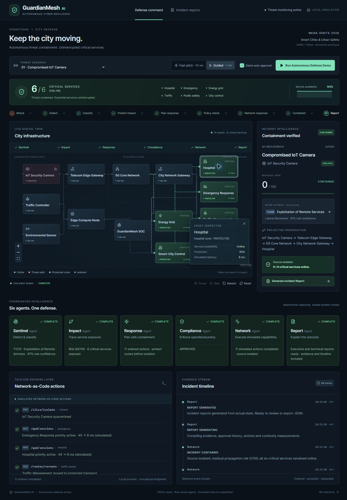
The 45 → 8 ms figures are simulated telemetry on selected assets. ServiceSample.latency is the rounded mean of all six critical assets; after camera defense that mean is 33 ms because the other four remain at 45 ms.


## 10 / Human-in-the-loop - Approve a guarded shared-segment action

Manual energy run: GM-48E962F8A27E
Compliance requires approval because isolating Edge Compute Node affects shared infrastructure. The ordered dry-run first protects Energy Grid and Smart-City Control routes. The engine enters AWAITING_APPROVAL; the captured before-state has zero network actions. Pause and Skip are disabled at this gate.
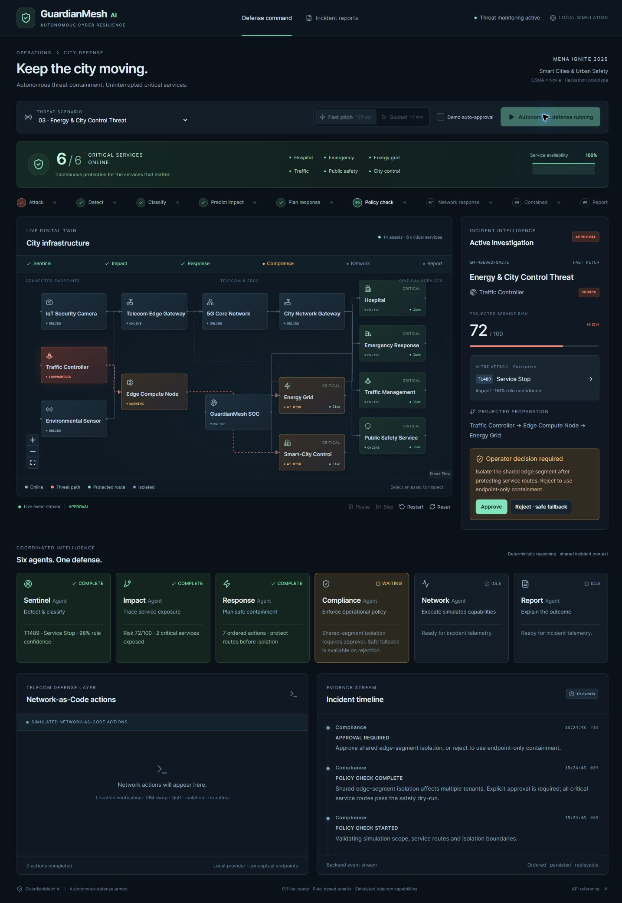
The operator clicked Approve. Approval records plan ID, version 1, decision APPROVE, actor OPERATOR and timestamp 15:25:28.709 UTC. Revalidation still enforces hard safety policy. Seven actions then complete, including segment isolation followed by source quarantine.


## 10 / Human-in-the-loop - Reject preserves evidence and chooses a safe fallback


| Path | Actual outcome |
| --- | --- |
| Approve · GM-48E962F8A27E | Plan v1; seven completed actions. Both Traffic Controller and Edge Compute Node isolated. Energy and city-control routes protected. |
| Reject · GM-3B9DF73610B7 | Plan v1 and its policy retained. REJECT by OPERATOR at 15:26:50.116 UTC. New v2 removes shared-segment isolation; six actions contain the source only. |
| Hard rejection | A plan that isolates a critical service or removes service continuity is rejected by policy and cannot be approved through the operator gate. |
| Controlled automatic demo | When enabled, the timer records actor DEMO_AUTOMATION. This is visibly disclosed and does not impersonate an operator. |
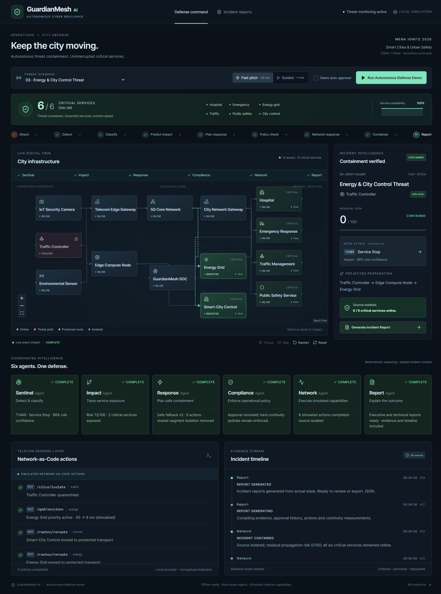
Rejection still ends at risk 0 with 6/6 services online. The outer persisted incident was later RESET; its retained report remains CONTAINED and preserves the original isolated source and approvals. The report, screenshot S19 and absence of isolate_segment in executed actions are the final rejection evidence.
Approval requests must match the active plan ID/version. Duplicate or stale decisions return 409. Skip cannot bypass approval. An operator decision accepted at the auto-approval deadline takes precedence; this race is covered by a backend test.


## 11 / Camera walkthrough - Flagship: from compromised camera to protected hospital


The main rehearsal started from Reset, selected Compromised IoT Camera and Fast pitch with Demo auto-approval enabled, and clicked Run Autonomous Defense Demo. Camera does not require an operator decision because its bounded endpoint plan passes policy automatically.
| Measured fact | Actual result |
| --- | --- |
| Incident | GM-3760FF663212 |
| Started / contained / report (UTC) | 20:45:49.123 / 20:46:09.470 / 20:46:11.358 |
| Timing | 20.347 s to containment; 22.235 s to report |
| Evidence / classification | 48 unauthorized remote sessions in 10 s; baseline 2; exploit signature true; T1210, 97% rule confidence. |
| Impact | Hospital path distance 4; peak risk 80; six critical services exposed. |
| Response / policy | Eleven ordered actions; plan version 1; APPROVED; no human approval required. |
| Final state | Camera ISOLATED; hospital/emergency PROTECTED at 8 ms simulated; all six critical routes protected; residual risk 0. |
| Availability / evidence | Minimum 6/6 operational at all 35 sampled events; all six agents COMPLETE; both reports generated. |
The following screenshots include an instrumented Guided run (GM-0D632E900149) to hold short phases still, and the uninterrupted Fast Pitch rehearsal. Captions distinguish them. Guided capture pauses explain its 167.295-second containment time; they are not Fast Pitch performance.


## 11 / Camera walkthrough - Attack begins; Sentinel examines the observations


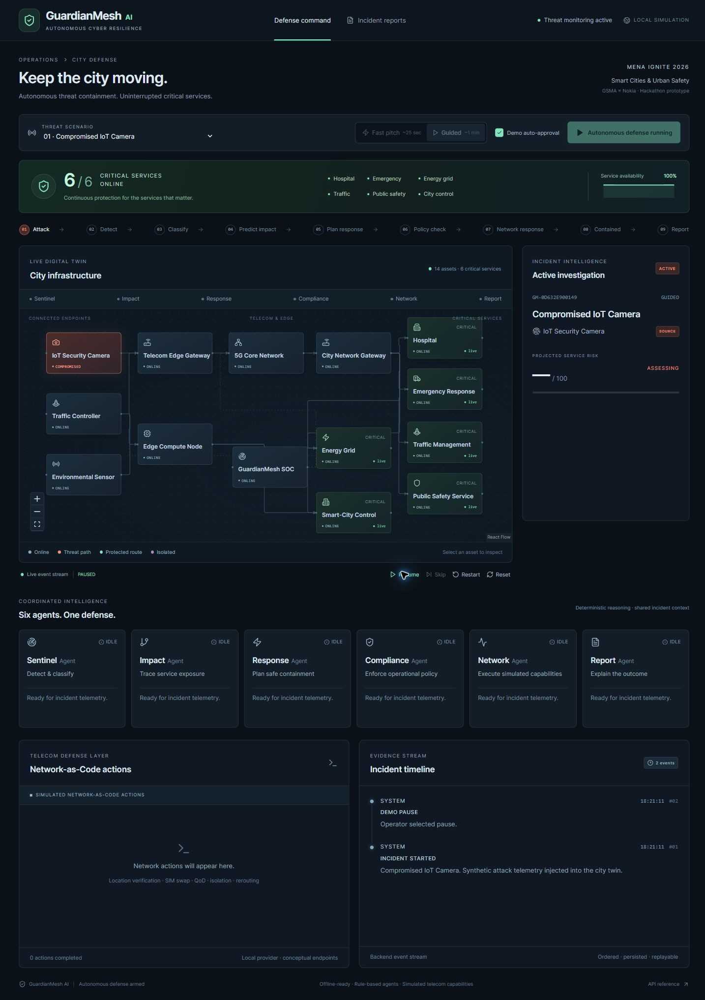

INCIDENT_STARTED immediately sets the source COMPROMISED. After the first timed interval, ANOMALY_DETECTED records the 48-versus-2 observation. The next interval stores THREAT_CLASSIFIED and begins Impact analysis. No packet capture, exploit or live camera control occurs.


## 11 / Camera walkthrough - The graph explains why the hospital is exposed

S05 · Guided capture: hospital at risk, still Online; graph exposure and availability are separate.
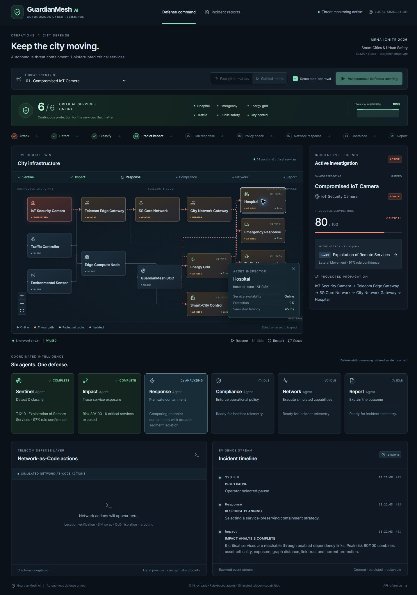
Response then creates eleven ordered actions. S06 records Compliance APPROVED and Network EXECUTING; the hospital reroute has already completed. The full plan and original policy are preserved in the report even though the concise UI focuses on stage findings.


## 11 / Camera walkthrough - Containment is the result, not just an alert

S26 · Uninterrupted Fast Pitch final topology with critical service continuity.
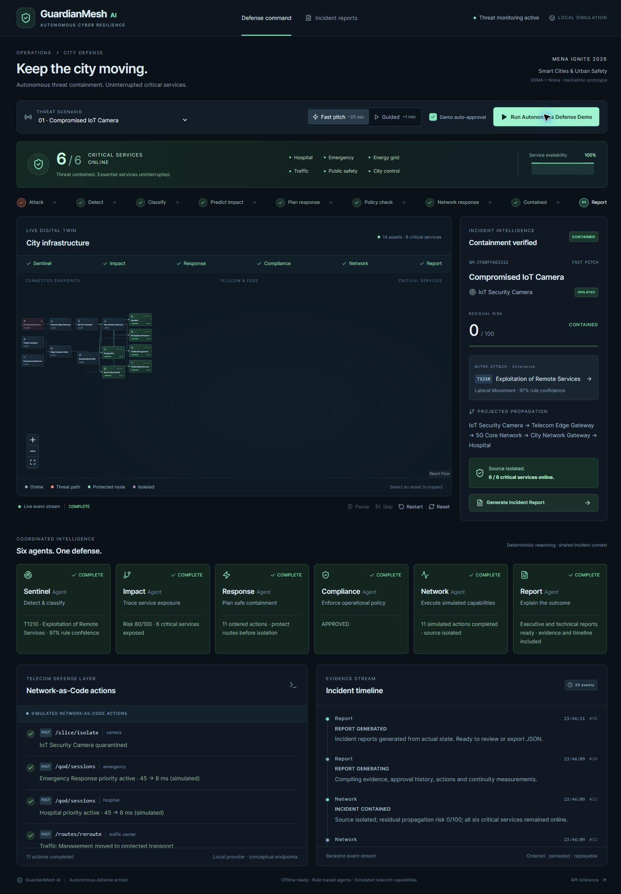


## 11 / Camera walkthrough - Complete measured timeline 1 of 2

GM-3760FF663212 · UTC clock; elapsed from backend started_at.
| # | UTC | Elapsed | Agent | Event | Actual message |
| --- | --- | --- | --- | --- | --- |
| 01 | 20:45:49.122 | +0.000s | SYSTEM | INCIDENT_STARTED | Compromised IoT Camera. Synthetic attack telemetry injected into the city twin. |
| 02 | 20:45:50.853 | +1.730s | Sentinel | ANOMALY_DETECTED | Camera opened 48 unauthorized remote-service sessions in 10 seconds; baseline is 2. |
| 03 | 20:45:52.582 | +3.459s | Sentinel | THREAT_CLASSIFIED | An exploit signature and unauthorized remote-service attempts indicate attempted lateral movement, not scanning alone. |
| 04 | 20:45:52.623 | +3.500s | Impact | IMPACT_ANALYSIS_STARTED | Calculating downstream exposure from the compromised asset. |
| 05 | 20:45:54.345 | +5.223s | Impact | IMPACT_ANALYSIS_COMPLETE | 6 critical services are reachable through enabled dependency links. Peak risk 80/100 combines asset criticality, exposure, graph distance, link trust and current protection. |
| 06 | 20:45:54.381 | +5.259s | Response | RESPONSE_PLANNING | Selecting a service-preserving containment strategy. |
| 07 | 20:45:56.116 | +6.993s | Response | RESPONSE_PLAN_CREATED | Preserve critical service availability before changing endpoint or segment access. Context checks, service rerouting and containment are ordered and policy validated. |
| 08 | 20:45:56.164 | +7.042s | Compliance | POLICY_CHECK_STARTED | Validating simulation scope, service routes and isolation boundaries. |
| 09 | 20:45:57.935 | +8.813s | Compliance | POLICY_CHECK_COMPLETE | Endpoint containment is bounded. Protected routes preserve all six critical services. |
| 10 | 20:45:57.997 | +8.874s | Network | NETWORK_RESPONSE_STARTED | SIMULATED NETWORK-AS-CODE ACTIONS · local deterministic provider. |
| 11 | 20:45:58.042 | +8.920s | Network | ACTION_EXECUTING | POST /device/location/verify · IoT Security Camera |
| 12 | 20:45:58.990 | +9.867s | Network | CONTEXT_VERIFIED | Location verified · hospital-zone |
| 13 | 20:45:59.017 | +9.895s | Network | ACTION_EXECUTING | POST /sim-swap/check · IoT Security Camera |
| 14 | 20:45:59.997 | +10.875s | Network | CONTEXT_VERIFIED | No suspicious SIM change · low identity risk |
| 15 | 20:46:00.059 | +10.937s | Network | ACTION_EXECUTING | POST /routes/reroute · Hospital |
| 16 | 20:46:01.025 | +11.902s | Network | TRAFFIC_REROUTED | Hospital moved to protected transport |
| 17 | 20:46:01.059 | +11.937s | Network | ACTION_EXECUTING | POST /routes/reroute · Emergency Response |
| 18 | 20:46:02.038 | +12.915s | Network | TRAFFIC_REROUTED | Emergency Response moved to protected transport |


## 11 / Camera walkthrough - Complete measured timeline 2 of 2

GM-3760FF663212 · UTC clock; elapsed from backend started_at.
| # | UTC | Elapsed | Agent | Event | Actual message |
| --- | --- | --- | --- | --- | --- |
| 19 | 20:46:02.084 | +12.962s | Network | ACTION_EXECUTING | POST /routes/reroute · Energy Grid |
| 20 | 20:46:03.054 | +13.932s | Network | TRAFFIC_REROUTED | Energy Grid moved to protected transport |
| 21 | 20:46:03.088 | +13.966s | Network | ACTION_EXECUTING | POST /routes/reroute · Smart-City Control |
| 22 | 20:46:04.070 | +14.948s | Network | TRAFFIC_REROUTED | Smart-City Control moved to protected transport |
| 23 | 20:46:04.153 | +15.030s | Network | ACTION_EXECUTING | POST /routes/reroute · Public Safety Service |
| 24 | 20:46:05.114 | +15.992s | Network | TRAFFIC_REROUTED | Public Safety Service moved to protected transport |
| 25 | 20:46:05.163 | +16.040s | Network | ACTION_EXECUTING | POST /routes/reroute · Traffic Management |
| 26 | 20:46:06.152 | +17.030s | Network | TRAFFIC_REROUTED | Traffic Management moved to protected transport |
| 27 | 20:46:06.213 | +17.091s | Network | ACTION_EXECUTING | POST /qod/sessions · Hospital |
| 28 | 20:46:07.211 | +18.089s | Network | QOD_ACTIVATED | Hospital priority active · 45 → 8 ms (simulated) |
| 29 | 20:46:07.294 | +18.172s | Network | ACTION_EXECUTING | POST /qod/sessions · Emergency Response |
| 30 | 20:46:08.281 | +19.159s | Network | QOD_ACTIVATED | Emergency Response priority active · 45 → 8 ms (simulated) |
| 31 | 20:46:08.352 | +19.230s | Network | ACTION_EXECUTING | POST /slice/isolate · IoT Security Camera |
| 32 | 20:46:09.370 | +20.248s | Network | DEVICE_ISOLATED | IoT Security Camera quarantined |
| 33 | 20:46:09.470 | +20.347s | Network | INCIDENT_CONTAINED | Source isolated; residual propagation risk 0/100; all six critical services remained online. |
| 34 | 20:46:09.566 | +20.444s | Report | REPORT_GENERATING | Compiling evidence, approval history, actions and continuity measurements. |
| 35 | 20:46:11.356 | +22.233s | Report | REPORT_GENERATED | Incident reports generated from actual state. Ready to review or export JSON. |


## 12 / Identity walkthrough - Correlate the identity anomaly before containment


| Stage | Actual scenario 2 behavior |
| --- | --- |
| Clean start | Reset then select Telecom Identity / SIM-Swap Risk, Fast pitch, Run. Source sensor begins COMPROMISED. |
| Detection | Trusted sensor re-registers from unexpected zone. Swap 12 min ago; ownership unconfirmed; location mismatch. |
| Classification / impact | Mobile T1451 SIM Card Swap; rule confidence 91%; suspected takeover. Risk 73/100; six dependent services, including Hospital. |
| Context and trust | Location verification FALSE / unexpected-zone; action result trust RESTRICTED. SIM check swapped_in_24h=true, minutes_since_swap=12, derived_risk=HIGH. |
| Plan / policy | Eleven actions; endpoint-only containment automatically APPROVED. Six reroutes, hospital/emergency QoD, source quarantine. |
| Outcome | Environmental Sensor ISOLATED, risk 0; all agents COMPLETE; 35 events; minimum six services online. |
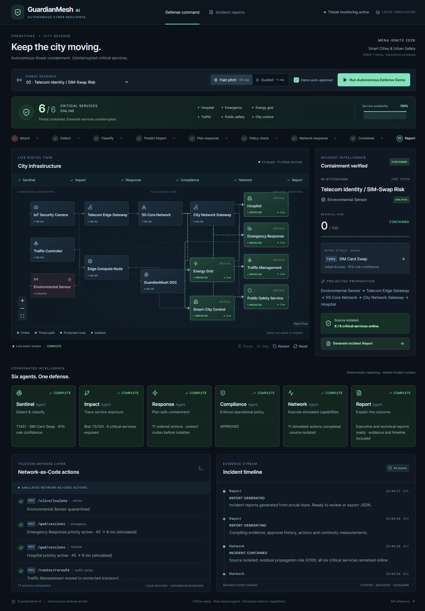


## 12 / Identity walkthrough - The location and SIM results are actual incident data


```text
{
  "location": {
    "verification": "FALSE",
    "zone": "unexpected-zone",
    "trust": "RESTRICTED",
    "simulated": true
  },
  "sim_swap": {
    "swapped_in_24h": true,
    "minutes_since_swap": 12,
    "derived_risk": "HIGH",
    "simulated": true
  }
}
```
Trust reduction is a recorded action result, not a persistent Asset trust field or live telecom identity enforcement. A real integration would need explicit identity authorization and an operator-supported policy action. The local scenario instead demonstrates the risk-informed containment path.


## 13 / Energy walkthrough - A different path through shared edge infrastructure


Scenario 3 compromises Traffic Controller, whose enabled control links reach Edge Compute Node, Energy Grid and Smart-City Control. It does not use the camera-to-hospital path. Twenty-six unauthorized service-stop requests outside maintenance map to Enterprise T1489 for the edge compute layer.
| Stage | Observed result |
| --- | --- |
| Impact | Risk 72/100; two critical services exposed. Selected path traffic → edge → energy. |
| Plan v1 | verify_location traffic; sim_swap traffic; reroute energy; reroute control; qod energy; isolate_segment edge; quarantine traffic. |
| Policy | APPROVAL_REQUIRED. Protect both impacted services before isolating their shared segment. Zero actions executed at the gate. |
| Approve | OPERATOR approved v1; seven actions; edge and traffic ISOLATED. Two protected routes preserve critical reachability. |
| Reject | Version 2 removes edge isolation; six actions; traffic isolated while edge stays available. Original plan/policy/decision retained. |
| Outcome | Both paths reach CONTAINED, residual risk 0, six agents COMPLETE, minimum 6/6 services online and actual reports. |
The manual Approve capture took 56.564 seconds to containment and 58.406 seconds to report, including deliberate approval waiting. Reject took 36.590 / 38.380 seconds, also including operator waiting. These durations are not automatic Fast Pitch benchmarks.


## 13 / Energy walkthrough - Shared edge isolated; energy connectivity preserved

S15 · Completed manual Approve path.
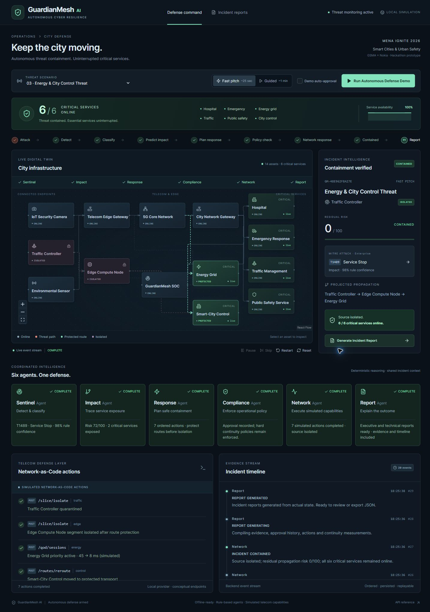
The approved segment action is the distinct behavior in Scenario 3. QoD targets Energy Grid (45 → 8 ms simulated), while camera/identity prioritize Hospital and Emergency Response.


## 14 / Guided Demo - Every control was exercised against the backend


| Control | Result | Actual verification |
| --- | --- | --- |
| Run | PASS | Guided selection starts a fresh camera incident with step_duration=5. |
| Pause | PASS | GM-0D632E900149 DEMO_PAUSE events hold a phase. First pause 15:21:11.661 to resume 15:21:42.967 has no intervening event. |
| Resume | PASS | DEMO_RESUME unblocks the existing run; current evidence and plan remain. |
| Skip | PASS | DEMO_SKIP advances the current delay. The next detection/phase appears; it does not bypass approval. |
| Restart | PASS | Energy run GM-48E962F8A27E reset; new GM-3B9DF73610B7 starts, captured in S16. |
| Reset | PASS | Cancels current execution and restores fourteen ONLINE nodes. Retains prior reports and timeline history. |
How to run: choose a scenario, click Guided, choose automatic approval or manual energy approval, then Run. Use Pause to discuss a stage, Resume to continue, or Skip to advance the current timed interval. Restart uses frontend reset followed by start; Reset returns to standby.
Uninterrupted camera Guided rehearsal GM-DC9807B37482 took 57.074 seconds to containment and 62.267 seconds to report. Expected final state: isolated source, 0 residual risk and 6/6 services. Manual approval and deliberate pauses add wall-clock time.

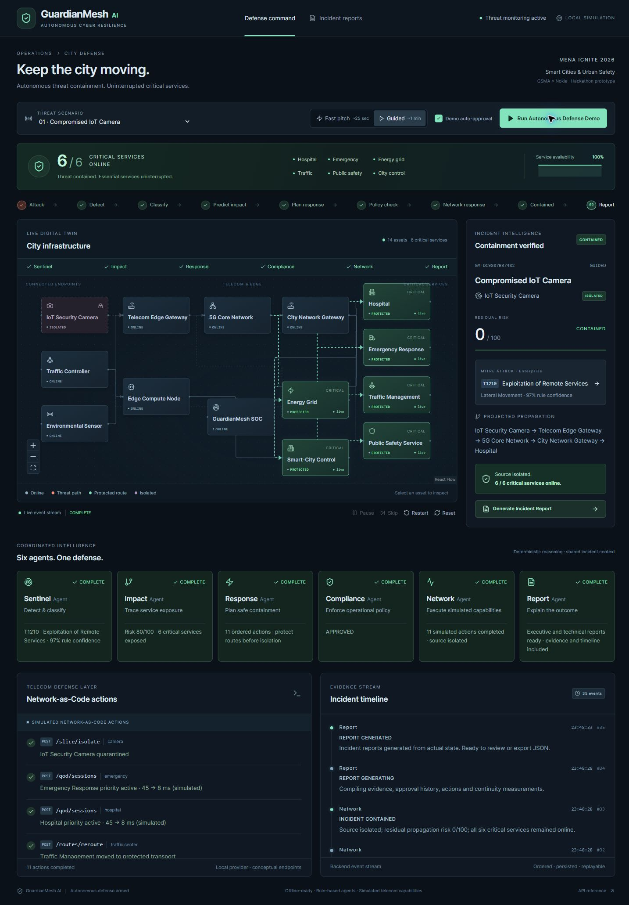


## 15 / Fast Pitch Mode - A complete story in 22.24 seconds


From a clean Reset: select Camera, Fast pitch, Demo auto-approval, then Run. No pause, skip or manual navigation was required to complete the defense. The backend timing parameter was 1.7 seconds per main stage; actions use 0.55 times that delay.
| Milestone | Measured elapsed |
| --- | --- |
| ANOMALY_DETECTED | 1.730 seconds |
| THREAT_CLASSIFIED | 3.459 seconds |
| IMPACT_ANALYSIS_COMPLETE | 5.223 seconds |
| RESPONSE_PLAN_CREATED | 6.993 seconds |
| NETWORK_RESPONSE_STARTED | 8.874 seconds |
| INCIDENT_CONTAINED | 20.347 seconds |
| REPORT_GENERATED | 22.233 seconds |
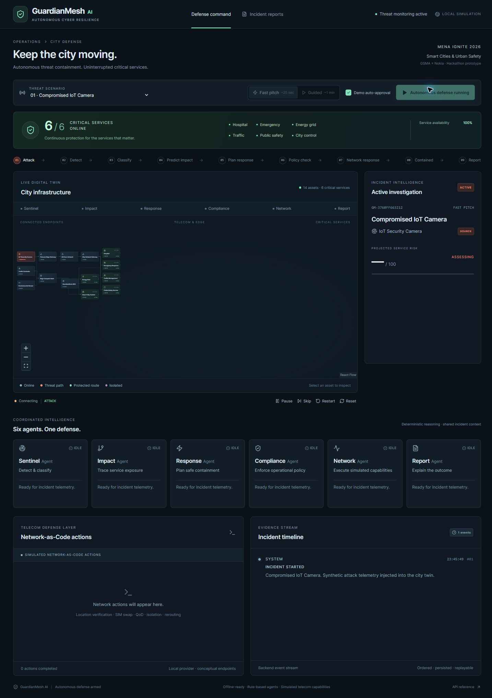
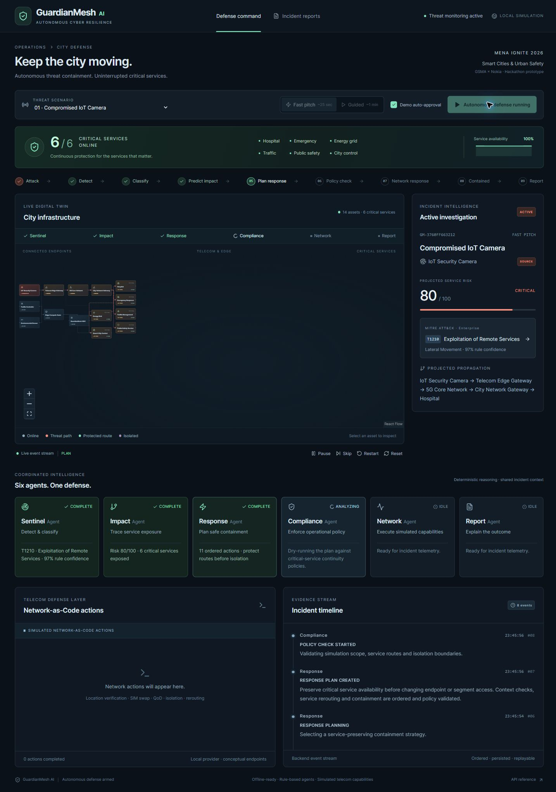
S26 on page 24 shows the final state. All 35 event samples record six services online. Containment is measured separately from report generation (20.347 versus 22.235 seconds). The panel and progress strip make the main story visible; Guided is clearer for detailed explanations.


## 16 / Incident reports - Executive summary from the actual run


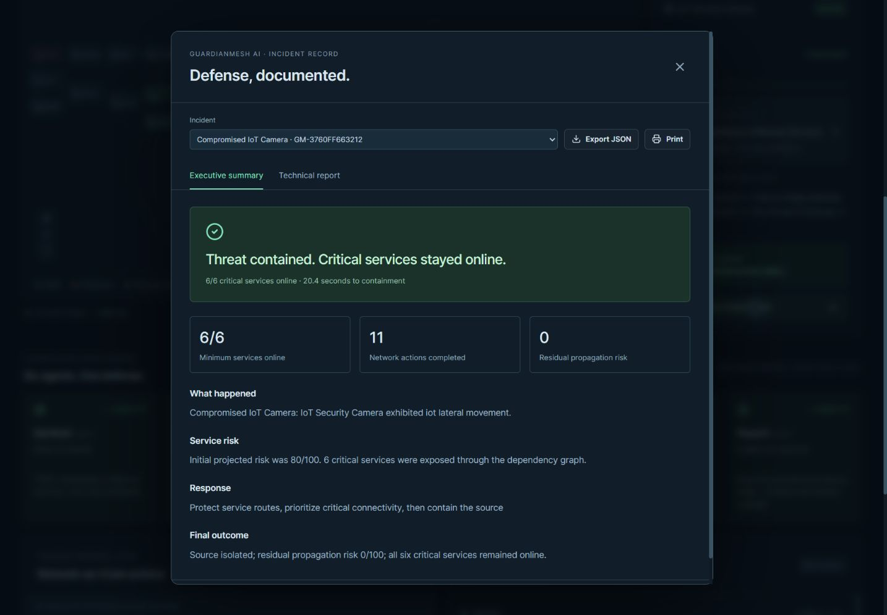
The executive report derives what happened, initial service risk, selected response, action count, availability, minimum online, residual risk, final outcome and duration. Report generation occurs automatically after containment. The button labeled Generate Incident Report opens the completed report.


## 16 / Incident reports - Technical evidence, history and export


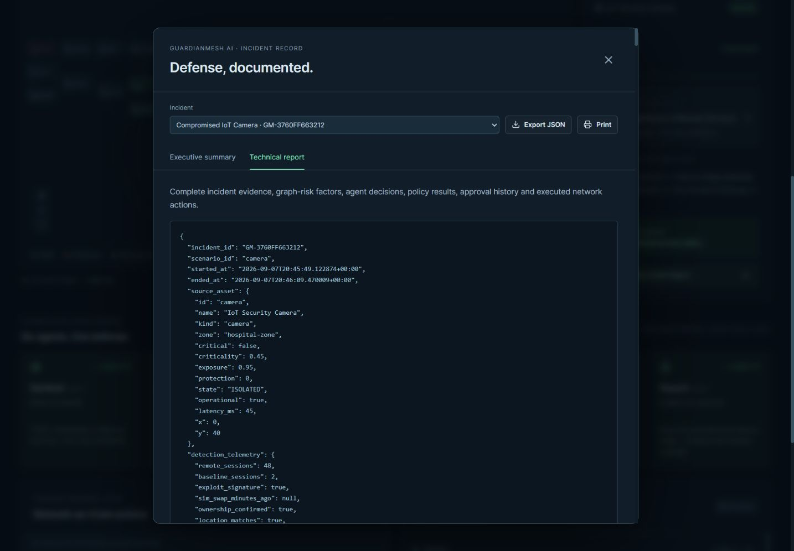
Technical fields: incident/scenario IDs; start/end; source asset; detection_telemetry; classification; initial/residual impact including path factors; plan and plan_history; all six agent_decisions; policy and policy_history; approval_history; network_actions; timeline; service_samples; final_state, outcome and simulation scope.
History loads the latest 100 incident summaries and filters completed reports. Reset does not erase reports. Export JSON returned HTTP 200 with an attachment filename matching the actual incident and matching technical.incident_id. Print is exposed as the browser print action; printer output was not separately certified.
```text
GET /api/incidents/GM-3760FF663212/report?download=true
200 OK
Content-Disposition: attachment;
 filename="GM-3760FF663212-incident-report.json"
```


## 17 / REST API - Actual routes and contracts

No invented telecom routes: conceptual provider labels are documented separately in section 09.
| Method / endpoint | Purpose | Input | Output |
| --- | --- | --- | --- |
| GET /api/health | Read service health | None | status ok, simulation true, provider local, agents 6, critical_services 6 |
| GET /api/topology | Baseline topology | None | Topology with 14 nodes and 21 links; not the active live twin |
| GET /api/scenarios | Selectable deterministic scenarios | None | id/title/subtitle/source/requires_approval catalog |
| GET /api/incidents | Recent persisted history | None | Up to 100 summaries ordered by started_at; has_report flag |
| POST /api/scenarios/{scenario_id}/start | Start one run | StartRequest: mode, auto_approve, optional step_duration | 201 Incident; 409 if a task is active |
| GET /api/incidents/{incident_id} | Read full current or saved incident | Path ID | Incident with live topology, evidence and report |
| GET /api/incidents/{incident_id}/timeline | Read ordered evidence | Path ID | TimelineEvent array |
| GET /api/incidents/{incident_id}/report | Read/export report | Path ID; download=false/true | Report JSON; attachment if requested; 409 until ready |
| POST /api/incidents/{incident_id}/approval | Record plan-bound decision | ApprovalRequest: plan_id, plan_version, APPROVE/REJECT | Updated Incident; actor assigned by server |
| POST /api/incidents/{incident_id}/{command} | Control engine | command: pause/resume/skip/reset; UI sends {} | Updated Incident; unknown command 404; invalid state 409 |


## 17 / REST API - Swagger exposes the implemented backend

Actual API documentation opened at http://127.0.0.1:8000/docs.
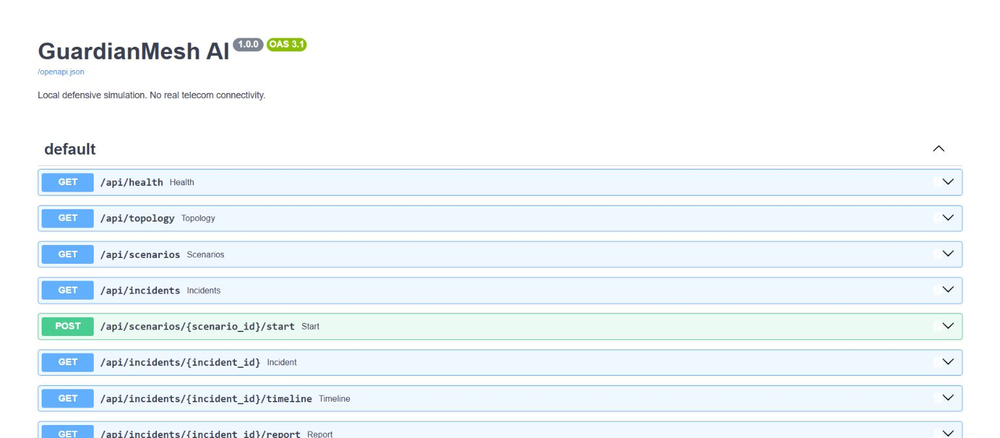
FastAPI default Swagger assets are fetched from a CDN; the docs viewer may require internet or cached assets. This auxiliary viewer is not a dependency of the installed primary Command Center. A saved openapi.json is included for offline technical review.


## 18 / WebSocket event system - Backend events drive the visualization


```text
ws://127.0.0.1:5173/ws/incidents/{incident_id}
{ "type": "SNAPSHOT", "seq": 46,
  "incident": { ...full current context and timeline... } }
Client optional text: ping     Server: { "type": "PONG" }
```
Engine.emit appends a sequential TimelineEvent, samples availability/risk/mean latency, commits the incident and related evidence in SQLite, then publishes a complete snapshot. The Vite /ws proxy forwards it to FastAPI. useGuardian accepts matching incident IDs and applySnapshot rejects older sequence numbers. React renders topology colors, agent states, progress, risk, actions and timeline from that shared state.
| Mechanism | Actual implementation / evidence |
| --- | --- |
| First connection / reconnect | subscribe queues the current full snapshot. UI reconnects after 1.5 s; prior state can be reconstructed without replaying commands. |
| Slow client | Queue maxsize 8. Old snapshots may be coalesced; the latest still contains the complete ordered timeline. |
| Message validation | Only text ping accepted from clients. Unknown IDs, foreign Origin, binary or other messages close with code 1008. |
| Runtime probe | 21 live messages including PONG. Ordered snapshots through sequence 46 and REPORT_GENERATED; online=6 throughout observed messages. |
| Visual verification | S07 network execution and S08 final state changed while the browser subscribed to the same actual incident. No frontend-only simulation engine exists. |
Important events: INCIDENT_STARTED, ANOMALY_DETECTED, THREAT_CLASSIFIED, IMPACT_ANALYSIS_COMPLETE, RESPONSE_PLAN_CREATED, POLICY_CHECK_COMPLETE, APPROVAL_REQUIRED, APPROVAL_RECORDED, SAFE_FALLBACK_SELECTED, ACTION_EXECUTING, CONTEXT_VERIFIED, TRAFFIC_REROUTED, QOD_ACTIVATED, DEVICE_ISOLATED, SEGMENT_ISOLATED, INCIDENT_CONTAINED, REPORT_GENERATED, DEMO_* and INCIDENT_RESET.


## 19 / Database - SQLite retains the decision trail


| Table | Important fields | Observed rows |
| --- | --- | --- |
| incidents | id, status, payload | 21 |
| events | id, incident_id, seq, payload | 703 |
| network_actions | id, incident_id, payload | 198 |
| approvals | id, incident_id, payload | 5 |
| reports | incident_id, payload | 20 |
Repository automatically creates backend/data/guardianmesh.db and the five tables using SQLAlchemy metadata. GUARDIAN_DATABASE_URL can override the location. Incident payloads are JSON text; events, actions, approvals and reports also have their own rows. Each emitted state and its evidence commit in one transaction.
```text
Example retained incident (synthetic local data):
{
  "id": "GM-3760FF663212",
  "status": "CONTAINED",
  "scenario_id": "camera",
  "source": "camera",
  "events": 35,
  "peak_risk": 80,
  "residual_risk": 0,
  "actions": 11,
  "minimum_services_online": 6
}
```
What persists; what does not
Persisted: incidents, ordered events, executed actions, approval actors/versions, reviewed plans/policies inside incident/report JSON, reports and continuity samples. Reset preserves history. An unfinished run becomes INTERRUPTED after restart; verified containment with a missing report can recover the report from saved evidence.
Not durable: active asyncio task, pause/skip/approval gates, subscriber queues and provider idempotency cache. No execution replay, cross-restart exactly-once guarantee, migration framework, retention policy or distributed database is implemented. UI history is capped at 100 recent incidents.


## 20 / Testing - Fresh tests passed; warnings are retained


```text
PS ...\Win\backend> ..\.venv\Scripts\python.exe -m pytest -q
........................................................... [100%]
59 passed, 2 warnings in 33.88s
```
| Suite | Actual result |
| --- | --- |
| Backend pytest | 59 passed; 0 failed; 0 skipped; 2 warnings; 33.88 s. Full stdout and JUnit XML saved. |
| Frontend Vitest | 11 passed in 4 files; 0 failed; 2.15 s. API 3, hook 3, App 3, Reports 2. |
| Additional runtime assertions | Captured reports checked for source isolation, 0 residual risk, six complete agents, all simulated actions COMPLETE and minimum 6 online. JSON export verified HTTP 200. |
What the suite checks
Risk direction, isolation, protection, cycles and alternative paths; bands and exact hospital score; focused mappings and insufficient observations; all six agents; ordered response and policy hard rejections; shared approval and rejection fallback; provider validation/idempotency; complete three-scenario lifecycles; pause/resume/skip/reset and overlapping starts; cancellation during provider work; provider failure; WebSocket malformed messages, origin, reconnect and backpressure; report and history persistence; restart recovery.
Actual warnings, not hidden failures
StarletteDeprecationWarning: using httpx with starlette.testclient is deprecated; the installed library suggests httpx2. DeprecationWarning: anyio.abc.BlockingPortal alias is deprecated in favor of anyio.from_thread.BlockingPortal. Both are upstream test-client warnings. Application code and pinned dependencies were preserved.
```text
PS ...\Win\frontend> npm test
Test Files  4 passed (4)
Tests       11 passed (11)
Duration    2.15s
```


## 21 / Frontend production build - TypeScript and Vite production output succeeded


```text
PS ...\Win\frontend> npm run build
> guardianmesh-command-center@1.0.0 build
> tsc -b && vite build

vite v6.4.3 building for production...
transforming...
2292 modules transformed.
rendering chunks...
computing gzip size...

dist/index.html                   0.78 kB
dist/assets/index-CNldKenc.css    52.68 kB
dist/assets/topology-CitRzoT2.js 197.84 kB
dist/assets/index-CI_OBj68.js    227.99 kB
dist/assets/charts-BX467RyK.js   339.60 kB

built in 7.26s
```
| Check | Result |
| --- | --- |
| TypeScript project build | PASS - tsc -b completed before Vite bundling. |
| Production bundle | PASS - 2,292 transformed modules; generated frontend/dist. |
| Warnings / errors | No build warnings or errors in captured stdout. |
| Visual/runtime scope | Browser rehearsals used the Vite development server. The production bundle was built successfully; Nginx/container runtime is separately unverified. |
Stack observed in source and locks: React 19, TypeScript, Vite 6, Tailwind 4, React Flow (@xyflow/react), Recharts and Lucide. Vite separates topology and chart chunks. No external paid frontend service or API key is required.


## 22 / Docker - Configuration present; runtime remains PARTIAL


Docker could not be executed: the docker command is unavailable on this machine. This report does not claim image build, container startup, healthcheck success or browser rehearsal through Nginx. Static inspection found referenced files, volume paths and proxy routes consistent.
| Component | Actual configuration |
| --- | --- |
| Backend image | Python 3.12-slim; locked dependencies; non-root guardian UID 10001; /app/data writable; one Uvicorn worker. |
| Frontend image | Node 22-alpine build stage runs npm ci and npm run build; Nginx 1.28-alpine serves dist. |
| Compose backend | Host 127.0.0.1:8000 → container 8000; named incident-data volume at /app/data; HTTP healthcheck. |
| Compose frontend | Host 127.0.0.1:8080 → Nginx 80; waits for healthy backend. |
| Proxy | /api forwards to backend:8000; /ws forwards Upgrade/Connection with HTTP/1.1 and a long read timeout. |
| Persistence / restart | Both services restart unless-stopped. Named volume survives normal docker compose down. |
```text
docker compose up --build -d
docker compose logs -f
docker compose down

Command Center: http://127.0.0.1:8080/
Backend API:    http://127.0.0.1:8000/api/health
```
Stop the local development backend first to avoid port 8000 conflict. Initial images and packages require download. Do not use docker compose down -v if incident history should survive. Before any Docker-based presentation, build and rehearse on a Docker-equipped machine.


## 23 / Exact startup - Run the existing local application on Windows


Existing installation: one command
```text
Set-Location "C:\Users\LOQ\Documents\ChatGPT\Win"
.\scripts\start.ps1

# Stop only the servers owned by this launcher
.\scripts\stop.ps1
```
The launcher checks/reuses GuardianMesh services and starts missing processes hidden. It writes stdout/stderr and validated process records in .logs. Processes started manually should be stopped with Ctrl+C in their own terminals.
Manual startup: two PowerShell terminals
```text
# Terminal 1: backend, exactly one worker
Set-Location "C:\Users\LOQ\Documents\ChatGPT\Win"
.\.venv\Scripts\python.exe -m uvicorn app.main:app `
  --app-dir backend --host 127.0.0.1 --port 8000

# Terminal 2: frontend
Set-Location "C:\Users\LOQ\Documents\ChatGPT\Win\frontend"
npm run dev
```
| Surface | Exact URL |
| --- | --- |
| Command Center | http://127.0.0.1:5173/ |
| Swagger API documentation | http://127.0.0.1:8000/docs |
| Health / OpenAPI | http://127.0.0.1:8000/api/health; http://127.0.0.1:8000/openapi.json |
| Docker frontend (unverified runtime) | http://127.0.0.1:8080/ |
Fresh installation only: install Python 3.12+ and Node.js 22+, then run .\scripts\setup.ps1 from the project root while online. It creates .venv if absent, installs requirements.lock.txt and runs npm ci. Do not reinstall or upgrade dependencies immediately before judging. SQLite initializes automatically.


## 24 / Judge experience - JUDGE REHEARSAL RESULT: PASS


| Judge criterion | Result / evidence |
| --- | --- |
| Problem and response objective obvious | PASS - headline, service banner, incident source and progress stages share one visual story. |
| Attack obvious | PASS - camera becomes COMPROMISED; later graph threat routes are red. S02/S24. |
| Agents visibly working | PASS - processing cards captured; compact strip stays above twin. S03/S06. Deterministic scope disclosed. |
| Hospital threat understandable | PASS - risk 80 and full projected camera-to-hospital path appear. S05/S25. |
| Network defends connectivity | PASS - protected routes, context results, QoD and quarantine reflect backend actions. S07-S09. |
| Simulation label clear | PASS - LOCAL SIMULATION header, SIMULATED NETWORK-AS-CODE ACTIONS feed and report disclaimer. |
| Containment and 6/6 obvious | PASS - isolated source, residual risk 0 and six-service banner. S26. |
| Reports explain actual incident | PASS - executive values and technical ID/timeline match captured API. S27/S28. |
| Coherent layout / visual defects | PASS for observed desktop rehearsal - no clipping, overlaps or broken app panels observed; detailed agent/feed content requires scrolling. |
| Console / backend runtime | PASS - captured browser error/warn log empty; all report assertions pass. No application runtime failure found. |
Rehearsal: clean Reset → Camera → Fast pitch → Run → observe classification, hospital risk and response → contained source with 6/6 → open executive and technical report. Measured 20.347 seconds to containment and 22.235 seconds to report. No application changes were necessary during this documentation pass.
Presentation advice: use a wide desktop window and Fast pitch for the first story, then Guided for questions. Explain that risk is graph exposure and QoD is simulated. Do not introduce new dependencies, change timing, delete SQLite, enable multiple workers or alter safety policy before submission.


## 25 / Visual gallery - 01  |  Idle Command Center

S01 · A normal city twin, six operational services and a ready defense engine.


## 25 / Visual gallery - 02  |  Attack, classification and impact

S04 · Compromised source, threat paths, MITRE mapping and hospital exposure in one view.


## 25 / Visual gallery - 03  |  Six agents and operator oversight


## 25 / Visual gallery - 04  |  Network actions and protected hospital


## 25 / Visual gallery - 05  |  Fast Pitch: the winning moment

S26 · 6/6 services remain online while the compromised camera is isolated.


## 25 / Visual gallery - 06  |  Two different incident paths

S21 and S15 · Identity risk and shared-edge disruption reach safe containment.


## 25 / Visual gallery - 07  |  The incident record closes the story


The technical view on page 34 preserves the same incident ID, original telemetry, MITRE mapping, graph-risk factors, plans, policies, actions and complete timeline. Export JSON returned the corresponding actual incident record.


## 26 / Limitations - What the prototype proves - and what it does not


| Category | Current boundary |
| --- | --- |
| Simulation | Synthetic telemetry and an in-memory digital twin. Provider outputs, protected transport, isolation and QoD latency are simulated. No real Nokia/CAMARA execution or authorized sandbox integration exists. |
| Intelligence | Six deterministic logical agents, three focused rules and fixed confidence indicators. No external LLM, trained anomaly model, full ATT&CK corpus, real SIEM or packet ingestion. |
| Risk / continuity | A simplified graph-exposure formula and modeled service reachability. No calibrated likelihood, real latency SLA or real-world uptime guarantee. |
| Identity | Location/SIM checks derive from synthetic telemetry. RESTRICTED trust is evidence in an action result, not production identity enforcement. |
| Security | Payload/identifier/origin/message controls are implemented. Authentication, RBAC, tenancy, TLS termination, rate limiting and enterprise audit controls are not. Localhost only. |
| Scale / resilience | One process, one active simulation, SQLite and full snapshots. Simple-path enumeration and repeated snapshot persistence suit 14 nodes. No distributed queue or cross-restart exactly-once execution. |
| Deployment | Local startup/tests/build verified. Docker runtime and production Nginx-serving rehearsal remain unverified. Initial packages/images and optional external documentation need internet/cache. |
| Prototype UX | Topology is inspectable, not editable. Detailed feeds and technical JSON require scrolling. Generate Incident Report opens an already generated report. Printing was not separately certified. |
The documentation run found no application defect requiring a code change. Browser automation briefly needed tab/viewport recovery; these capture-tool issues did not produce app console errors. Source functionality and dependency versions were preserved.


## 27 / Roadmap - Keep the proven prototype separate from future work


| Current prototype | Post-hackathon work - not implemented |
| --- | --- |
| Local simulated NetworkProvider | Authorized operator sandbox adapter with exact versioned API contracts, device IDs, consent, credentials and network permissions. |
| Deterministic observations / focused rules | Real telemetry ingestion, SIEM/SOC correlation, rule evaluation against labeled evidence and monitored false-positive/negative rates. |
| Versioned plan + policy gate | Operator-approved production control policies, service dependency validation, compensation/rollback and provider failure handling. |
| Rule-generated explanations and reports | Optional LLM provider for wording/explanation with grounded evidence, constrained outputs and a reliable deterministic fallback. |
| Local origin guard and schemas | Authentication, authorization/RBAC, tenant isolation, protected audit storage, TLS and secret management. |
| Single engine + SQLite | Durable job queue, production database, migrations, distributed coordination, idempotent recovery and retention. |
| Basic JSON logs and tests | Metrics/traces, operator dashboards, scale/chaos tests and incident playbooks. |
| Locally rehearsed demo | Telecom operator pilot with authorized sandbox tests first, then measured network service outcomes under reviewed controls. |
A practical pilot sequence
First validate real topology and ownership. Then map only authorized sandbox capabilities behind NetworkProvider, with exact input/output contracts. Update the current SIMULATION_ONLY policy through review; it intentionally rejects non-simulated providers today. Add asynchronous session handling, cancellation, failure compensation and integration tests before any production control is enabled.
Avoid substituting a live provider directly into the judge demo. The installed deterministic mode remains the reliable baseline and regression fixture while new integrations are developed separately.


## 28 / Final verification matrix - Definition of Done 1 of 2

Judgments apply to the deterministic local prototype, with limitations stated explicitly.
| Original major requirement | Result | Evidence / reference |
| --- | --- | --- |
| Frontend starts | PASS | Actual Vite Command Center; S01; UI rehearsals. |
| Backend starts | PASS | /api/health status ok; six agents; actual REST/WS. |
| Database initializes | PASS | Repository create_all; five live SQLite tables; tests. |
| WebSocket works | PASS | 21 captured messages, PONG, final seq46; DOM changes. |
| Approximately 14 nodes | PASS | 14 assets / 21 links; S01 and topology.json. |
| Six agents implemented | PASS | Six real classes; all COMPLETE in every report. |
| MITRE mapping works | PASS | T1210 / T1451 / T1489 rules, evidence, tests and UI. |
| Dependency impact calculation | PASS | Directed simple-path scoring; hospital 80; tests. |
| Network-as-Code simulation | PASS | Six operation kinds; explicit simulated results; actions. |
| Human approval exists | PASS | Zero pre-approval actions; OPERATOR Approve/Reject; v2. |
| Three incident scenarios | PASS | Camera, identity, energy completed; reports / screenshots. |


## 28 / Final verification matrix - Definition of Done 2 of 2

Judgments apply to the deterministic local prototype, with limitations stated explicitly.
| Original major requirement | Result | Evidence / reference |
| --- | --- | --- |
| Clean scenario reset | PASS | Baseline restored; history retained; restart ID changed. |
| Guided Demo works | PASS | 62.267 seconds to report; all controls exercised. |
| Fast Pitch Mode works | PASS | 22.235 seconds to report; uninterrupted clean rehearsal. |
| Critical services visibly online | PASS | 6/6 banner and minimum online6 at all camera events. |
| Timeline reflects backend events | PASS | Actual 35-event camera timeline on pp25-26; WS chain. |
| Reports generated | PASS | Executive/technical actual data; JSON attachment200. |
| Tests pass | PASS | Backend59; frontend11; two disclosed test warnings. |
| Production frontend build | PASS | tsc + Vite; 2,292 modules; 7.26s; no build warnings. |
| Docker works or blocker disclosed | PARTIAL | Configuration inspected; Docker unavailable. Original DoD permits disclosed blocker. |
| README exact startup | PASS | Manual and script commands match source; pp41-42. |
| Additional scope | Status |
| --- | --- |
| Real carrier execution / authorized sandbox | NOT APPLICABLE to local DoD; NOT IMPLEMENTED. |
| Optional LLM interface | NOT APPLICABLE to mandatory DoD; optional, unimplemented. |
| Production auth / distributed deployment | NOT APPLICABLE to hackathon scope; future work. |
| Report package and visual verification | PASS - 28 sections, actual screenshots, source hashes, stdout, PDF rendering and visual QA. |
No mandatory local-demo feature remains FAIL. Docker runtime remains PARTIAL. The disclosed-blocker requirement is satisfied, while real container execution remains an explicit open verification item. All scenario outcomes are simulated service-protection evidence, not claims about a carrier network.
