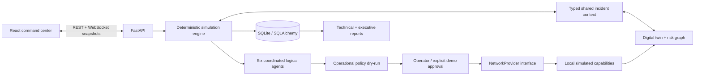

# GuardianMesh AI

**Autonomous Cyber Resilience for Critical Infrastructure**

A new, local hackathon prototype for **MENA Ignite 2026 — GSMA × Nokia**, aligned with **Smart Cities, Urban Safety & Mega-Project Infrastructure**. A compromised endpoint is detected, its service dependencies are assessed, a safe containment plan is checked, and simulated telecom capabilities preserve essential connectivity.

The defining moment: **the compromised source is visibly isolated while 6 / 6 critical services remain online.**

## Run on this Windows machine

The project lives at `C:\Users\LOQ\Documents\ChatGPT\Win`.

Dependencies are already installed. From PowerShell in that directory:

```powershell
.\scripts\start.ps1
```

Open **http://127.0.0.1:5173/**. API docs: **http://127.0.0.1:8000/docs**.

Stop servers started by this script with:

```powershell
.\scripts\stop.ps1
```

The start script checks existing GuardianMesh services, starts missing services in hidden background processes, and writes diagnostics to `.logs/`. The stop script checks process ownership before stopping anything. Servers started manually should be stopped with Ctrl+C in their terminals.

On a fresh machine, install **Python 3.12+ and Node.js 22+**, then run once with internet access:

```powershell
.\scripts\setup.ps1
.\scripts\start.ps1
```

The locked dependencies and container images must be downloaded before going offline. **After installation, every primary demo capability runs without internet, API keys, paid services, external fonts, an LLM, or cloud databases.** MITRE documentation links are optional external reading; all classification content is stored locally.

## Judge demonstration

1. Select **01 · Compromised IoT Camera**, **Fast pitch**, and keep **Demo auto-approval** enabled.
2. Click **Run Autonomous Defense Demo**. Expect roughly **20–25 seconds** to the completed report, depending on the machine.
3. Watch the camera turn compromised, red threat paths reach hospital dependencies, the six logical agents complete their work, protected transport appears, and the source becomes isolated.
4. Point to **6 / 6 CRITICAL SERVICES ONLINE**, residual risk **0**, and the simulated network actions.
5. Click **Generate Incident Report** to open the already-generated evidence report. Switch between Executive summary and Technical report; export JSON or print.
6. Click **Reset** for a clean city twin. **Restart** resets and launches the selected scenario in one operation.

For a longer walkthrough use **Guided** (approximately one minute). **Pause**, **Resume**, and **Skip** control the backend engine. Skip advances the current timed step; it never bypasses human approval. The UI is responsive; use a full-width browser at 1440px or wider for the clearest command-center presentation. Smaller screens stack panels vertically.

### Three deterministic scenarios

| Scenario | Evidence and mapped technique | Distinct response |
|---|---|---|
| Compromised IoT Camera | Synthetic remote-service exploit signature and unauthorized lateral movement attempts; Enterprise T1210 | Verify context, protect all six service routes, prioritize hospital/emergency connectivity, quarantine camera |
| Telecom Identity / SIM-Swap Risk | Unconfirmed SIM transfer, recent SIM change and location/authentication anomaly; suspected Mobile T1451 | Verify location, check swap history, mark endpoint trust restricted, protect dependencies and quarantine sensor identity |
| Energy & City Control Threat | Unauthorized service-stop attempts against edge compute; Enterprise T1489 | Protect energy/city-control routes, prioritize energy telemetry, request shared-segment approval, isolate edge segment and source |

**Manual approval:** choose Energy, disable **Demo auto-approval**, then run. The engine waits before any network execution. **Approve** permits the safety-checked segment action. **Reject · safe fallback** removes segment isolation, creates plan version 2, revalidates it, and contains only the source. A rejection still completes successfully. With automatic approval enabled, a visible decision is recorded as **DEMO_AUTOMATION**, never as a human operator. Hard safety rejection cannot be overridden by approval.

## Problem and solution

Connected hospitals, emergency response, energy networks and city services share telecom dependencies. An endpoint compromise can threaten essential service continuity. Alert-only handling leaves the operator to reconstruct those dependencies under time pressure.

GuardianMesh combines a directed digital twin, explainable threat rules, graph-based risk, operational policies, and a simulated Network-as-Code provider. The response protects connectivity before containment, verifies the remaining graph, and produces an evidence-backed report.

## Architecture



- **API:** payload validation, controlled identifiers, lifecycle controls, report/history reads, origin checks, and a push-only WebSocket stream with optional `ping`.
- **Simulation engine:** one active run, cancellable task, pause/approval gates, skip, reset, deterministic scenario order, and complete snapshots with increasing event sequences.
- **Shared context:** Pydantic models for assets, dependency links, classifications, risk factors, plans, approvals, actions, agent state, events, samples and reports.
- **Persistence:** separate SQLite tables for incidents, events, actions, approvals and reports. Each emission commits its snapshot and evidence atomically. Reset retains historical evidence. Backend restart marks an unfinished run interrupted; verified containment with an unfinished report is recovered from persisted evidence. Each reviewed plan and policy version is retained, including rejected plans.
- **WebSocket:** the initial and every subsequent message contains a complete incident snapshot and ordered timeline. A reconnect receives current state, so no prior events need replaying to reconstruct the UI. Slow-client queues coalesce snapshots without losing the full event history. The frontend ignores older sequence numbers.

### Six agents

| Agent | Responsibility |
|---|---|
| Sentinel | Inspect scenario evidence; return threat type, rule confidence, focused ATT&CK mapping and explanation |
| Impact | Traverse enabled directed dependency paths and score downstream service exposure |
| Response | Order context checks, route protection, service priority and bounded isolation |
| Compliance | Dry-run plan; forbid critical isolation and unauthorized providers; require approval for shared infrastructure |
| Network | Execute actions through the simulated provider with stable idempotency keys |
| Report | Derive both reports from the actual incident, including decisions, evidence, approval actors and continuity samples |

These are **six deterministic logical agents**, not six external LLM calls. Sentinel evaluates numeric/boolean telemetry: remote-service activity must exceed five times baseline with an exploit signature; SIM risk requires a recent swap plus unconfirmed ownership and a location mismatch; service-stop attempts must exceed the threshold outside maintenance. Benign or insufficient evidence is rejected. Rule confidence values are fixed rule confidence indicators, not empirically calibrated probabilities. No random output is used.

### Digital twin and risk model

The 14 assets comprise three connected endpoints, telecom edge gateway, 5G core, city gateway, edge compute, GuardianMesh SOC, and six critical services: hospital, emergency response, energy grid, traffic management, public safety and smart-city control.

Edges point from an upstream asset to its dependent consumer. Management links cannot propagate the attack. Protected core transport bypasses access gateways and is enabled by simulated rerouting. Risk and availability are separate: **AT_RISK is still operational**.

For each simple attack path to a node:

```text
risk = round(100 × severity
             × (0.55 × criticality + 0.25 × exposure + 0.20 / (1 + 0.2 × distance))
             × product(link weights)
             × (1 − protection))
```

Factors lie in `[0,1]`. Link weights: data `1.0`, identity `0.95`, control `0.9`. Disabled, protected-transport and management links are excluded from threat propagation. Cycles are bounded by simple-path traversal. The maximum path score per destination is retained (a shorter path is not always riskier). Initial incident risk is the maximum critical-service risk; factors and the selected propagation route are retained in the report. Bands: LOW `<30`, MODERATE `30–59`, HIGH `60–79`, CRITICAL `≥80`.

Camera hospital exposure is deterministically **80/100**. Isolation disables source threat paths, reducing residual propagation risk to **0/100**. Continuity is separately verified by traversing healthy service paths from the 5G core to every operational critical service. This is a simplified exposure model, not a prediction of real-world compromise probability.

### Simulated Network-as-Code

Every result explicitly contains `simulated: true`. The provider does not open sockets or contact any network operator.

| Conceptual operation | Local result | Integration meaning |
|---|---|---|
| `POST /device/location/verify` | TRUE/FALSE plus a city-zone interpretation | Inspired by Location Verification; a city zone is app-level interpretation |
| `POST /sim-swap/check` | Swap flag/time and derived LOW/HIGH risk | CAMARA returns swap information; risk is GuardianMesh interpretation |
| `POST /qod/sessions` | EMERGENCY_DEMO priority, 45 → 8 ms | Demo profile and simulated telemetry, not a production guarantee |
| `POST /slice/isolate` | Endpoint or shared-segment isolation | Conceptual operator action, not a universal CAMARA quarantine API |
| `POST /routes/reroute` | Protected transport to a critical service | Conceptual route protection, not a generic standardized hospital failover API |

These paths are **internal provider operation labels** displayed in the action feed. They are not exposed as unguarded REST endpoints and are not claimed to match a provider's production OpenAPI contract.

Future real integration: implement `NetworkProvider`, pin the operator's exact OpenAPI versions, obtain authorized sandbox credentials/consent, map real device and network identifiers, handle asynchronous QoD/session status and provider failures, enforce idempotency and compensating actions, then extend policy and integration tests. The current policy deliberately rejects non-simulated providers; enabling a real adapter requires a reviewed policy change. No operator adapter is currently enabled.

Official references: [MITRE T1210](https://attack.mitre.org/techniques/T1210/), [Mobile T1451](https://attack.mitre.org/techniques/T1451/), [T1489](https://attack.mitre.org/techniques/T1489/), [CAMARA Location Verification](https://camaraproject.org/location-verification/), [SIM Swap](https://camaraproject.org/sim-swap/), [Quality on Demand](https://camaraproject.org/quality-on-demand/), [Traffic Influence](https://camaraproject.org/traffic-influence/), [Nokia Network as Code](https://networkascode.nokia.io/_docs/).

## Development commands

Windows, two terminals from the project root:

```powershell
# Terminal 1 — backend (one worker)
.\.venv\Scripts\python.exe -m uvicorn app.main:app --app-dir backend --host 127.0.0.1 --port 8000

# Terminal 2 — frontend
cd frontend
npm run dev
```

Linux/macOS setup and startup, from the project root:

```bash
python3 -m venv .venv
.venv/bin/python -m pip install -r backend/requirements.lock.txt
npm --prefix frontend ci
# Terminal 1
.venv/bin/python -m uvicorn app.main:app --app-dir backend --host 127.0.0.1 --port 8000
# Terminal 2
npm --prefix frontend run dev
```

The Vite server proxies `/api` and `/ws` to the backend. SQLite initializes automatically at `backend/data/guardianmesh.db`. For isolated testing, `create_app(database_url)` accepts a dedicated SQLite URL. `GUARDIAN_DATABASE_URL` optionally overrides the default local database.

## Docker

```bash
docker compose up --build -d
docker compose logs -f
docker compose down
```

Open **http://127.0.0.1:8080/**. The frontend is a production Vite build served by Nginx; Nginx proxies HTTP and WebSocket traffic to FastAPI. A named volume retains incidents. Both published ports bind only to localhost. Stop local development servers first because the backend also uses port 8000.

**Validation limitation:** Docker is not installed on the build machine, so an actual container build/start could not be executed here. Compose structure and referenced paths are checked; runtime container validation remains for a Docker-equipped machine. Local startup, builds, API integration and browser demonstrations are verified separately. Do not use `docker compose down -v` if you want to retain incident history.

## Tests

From Windows PowerShell:

```powershell
Push-Location backend
..\.venv\Scripts\python.exe -m pytest -q
Pop-Location
npm --prefix frontend test
npm --prefix frontend run build
```

Linux/macOS:

```bash
(cd backend && ../.venv/bin/python -m pytest -q)
npm --prefix frontend test
npm --prefix frontend run build
```

Backend coverage: topology direction/cycles/alternative paths, exact risk factors and bands, ATT&CK rules, all six agents, policy dry-run, shared-target approval, safe rejection, simulator idempotency, all three complete scenarios, reports/persistence, pause/resume/skip, cancellation during approval/provider execution, historical reset isolation, reconnect/backpressure, malformed WebSocket frames, origin rejection and schema validation.

Frontend coverage: command-center rendering, mode/approval selection, action callbacks, approval/rejection UI, API errors, WebSocket state reduction, actual hook lifecycle and reset behavior. Browser verification exercises the full local application, scenario controls, source state changes, continuity, six agents and both report views. See `docs/VALIDATION.md` for recorded results.

## Project structure

```text
backend/
  app/
    main.py           REST, WebSocket, application lifecycle
    models.py         Typed shared incident and API schemas
    topology.py       14-asset city twin and continuity checks
    scenarios.py      Three deterministic evidence sets
    risk.py           Directed graph traversal and risk factors
    agents.py         Six logical agents
    policies.py       Plan dry-run and approval requirements
    provider.py       Provider protocol and safe simulator
    engine.py         Scenario orchestration and controls
    persistence.py    SQLAlchemy/SQLite evidence storage
    reporting.py      Reports derived from incident state
  tests/              Unit and integration tests
  data/               Auto-created local database (gitignored)
frontend/
  src/
    App.tsx            Command center and controls
    useGuardian.ts     Backend lifecycle + live subscription
    api.ts, types.ts   Typed transport and snapshot reduction
    components/        React Flow twin, panels and reports
    styles.css, polish.css  Responsive command-center design
    *.test.*           Frontend checks
  public/              Local brand asset
scripts/               PowerShell setup/start/stop
docs/                  Validation record
compose.yaml           Local Docker deployment
```

## Limitations and presentation stability

- Safe synthetic telemetry only: no packet capture, scanning, exploitation, real device control or unauthorized network operations.
- No external LLM, production Nokia connection, authentication, enterprise tenancy, or real-world availability guarantee.
- One process and **one Uvicorn worker**. Simulation execution state is in memory; evidence is persistent. Do not use multiple workers or hot-reload during a live demonstration.
- The entire city is a compact directed graph. Protected routes, QoD latency changes and confidence values are modeled assumptions, disclosed in the UI/report.
- Pause is supported while RUNNING. While waiting for manual approval, the approval gate already freezes execution; skip/pause cannot bypass it. Restart/reset may cancel any pending run.
- The application is intended for localhost; do not publicly expose its control APIs without authentication, authorization, rate limits and deployment review.
- **Before judging:** keep dependency lockfiles, installed `.venv`/`node_modules`, ports, scenario timing and safety rules unchanged. Avoid package upgrades, multiple backend workers or database removal just before presenting. Run one camera demo, reset, and leave Fast pitch selected with Demo auto-approval on.
