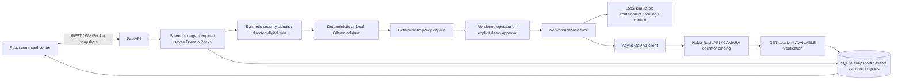

# GuardianMesh interactive network integration

This document describes the current implementation. The older PDF is an archived Smart City report, not evidence of live carrier connectivity.

## Implemented architecture



The existing domain packs, graph traversal, MITRE rules and six agents remain intact. The LLM supplies bounded advisory text and references. It cannot construct an executable plan, change an approval, select arbitrary URLs or invoke a provider. Response plans still come from domain policies and pass the deterministic dry-run before execution.

## External capability and official contract

Nokia's official **QoD v1** HTTP documentation was checked on 2026-09-11, including its cURL tabs:

- [QoD sessions](https://networkascode.nokia.io/_docs/quality-on-demand/qod-sessions)
- [Application keys and test devices](https://networkascode.nokia.io/_docs/getting-started)
- [QoD lifecycle](https://networkascode.nokia.io/_docs/quality-on-demand/qod-notifications-and-life-cycle)

Implemented operations: POST `/quality-on-demand/v1/sessions`, GET and DELETE `/sessions/{sessionId}`, POST `/sessions/{sessionId}/extend`. Nokia binding: origin `https://network-as-code.p-eu.rapidapi.com`, `X-RapidAPI-Host: network-as-code.nokia.rapidapi.com`, `X-RapidAPI-Key` from the application's console. Nokia uses an application API key here, not an invented OAuth client-credentials flow. Request fields: `device`, `applicationServer`, `qosProfile`, `duration`. The adapter accepts documented `status` and CAMARA `qosStatus` response aliases.

Nokia test phone numbers beginning `+9999` route to its provider simulator. A successful request using those identifiers is **real external API execution against a SANDBOX**, not physical mobile-network QoS. GuardianMesh displays the environment separately from the execution provenance. Production device consent, operator enrollment and billing remain outside this local prototype.

Generic CAMARA mode accepts an already-authorized bearer token and an explicitly configured QoD v1 sessions URL. Token issuance/refresh depends on the operator's consented OAuth flow and is not implemented generically. No unsupported API-version negotiation or callback endpoint is claimed. Lifecycle verification uses bounded GET polling; push callbacks are not implemented.

## Configuration

Copy `.env.example` to `.env` in the project root. `.env` is ignored by Git and loaded by the backend; existing process environment takes precedence. Restart the backend after editing configuration.

For the documented Nokia sandbox:

```dotenv
GUARDIANMESH_NETWORK_PROVIDER=nokia
GUARDIANMESH_NETWORK_MODE=SIMULATION
NOKIA_API_KEY=<application API key entered locally>
GUARDIANMESH_LIVE_AUTHORIZED=true
GUARDIANMESH_PROVIDER_ENVIRONMENT=SANDBOX
GUARDIANMESH_QOD_SESSIONS_URL=https://network-as-code.p-eu.rapidapi.com/quality-on-demand/v1/sessions
GUARDIANMESH_QOD_BINDINGS={"hospital":{"device":{"phoneNumber":"+999991234567"},"applicationServer":{"ipv4Address":"233.252.0.2"},"qosProfile":"QOS_E","duration":300}}
```

The application server and device must match the environment you are authorized to use. The values above are Nokia's documented test-address pattern. Configure a profile available to that application; rejection is surfaced, never fabricated as success. Only the hospital target is bound in this example. Emergency priority and all other actions explicitly remain local simulation. Other domain targets can be mapped independently using the same schema. Do not put keys in `VITE_*` variables.

The UI starts in SIMULATION and submits the selected mode explicitly. `GUARDIANMESH_NETWORK_MODE` controls the default for API clients that omit it. Modes:

| Requested mode | Behavior |
|---|---|
| SIMULATION | No carrier request; deterministic local results |
| LIVE | Bound QoD calls external provider; failed QoD stops the run |
| AUTO | Attempts live QoD; local fallback only when the explicit checkbox/request flag is enabled and outcome is known safe |

Timeouts after POST, malformed create responses and uncertain network failures never trigger automatic fallback or a repeat POST. An accepted session with pending verification keeps its external ID for inspection/cleanup. A LIVE request does not make unimplemented quarantine/routing/context operations live.

## Lifecycle, persistence and safety

The engine emits and persists request-started, accepted/session-created, lookup, verification, failure/fallback and cleanup events. Each action exposes provider, mode, environment, operation, external ID, HTTP state, QoD state, verification, timestamp and sanitized lifecycle metadata. Only whitelisted response fields are retained. Tokens, full response bodies, authorization headers, device phone numbers and application addresses are not included in execution evidence.

POST create and extend are not retried. GET has at most one safe retry and bounded polling. Connection/response/total time limits apply. Responses are limited to 64 KiB and validated. HTTPS, public-host checks, no redirects, no inherited proxy environment and server-only binding configuration restrict external requests. The Nokia destination is fixed to the documented endpoint. Generic CAMARA DNS is checked for private addresses; deployment-grade DNS pinning/egress controls remain a production hardening item.

Approval is serialized, plan/version matched and persisted. Manual mode gates all scenarios. Rejection in manual or external mode executes no planned actions. The legacy policy-controlled shared-segment rejection path remains available to API callers that omit `manual_approval`. Repeated approvals cannot duplicate execution. Critical-service isolation and route-breaking plans are rejected before any provider call. Failed incidents now have honest audit reports with FAILED state.

Session management is incident/action-scoped: POST `/api/incidents/{incident_id}/actions/{action_id}/lookup|delete|extend`. Extension is fixed at 300 seconds through the UI. Operations cannot be run during active orchestration. Reset deletes owned known external sessions before clearing the twin; cleanup failure is visible and retains evidence. Reset refuses to cancel an in-flight external create/verification request. Unknown POST outcomes may need console inspection and expire according to the requested duration. Shutdown preserves interrupted evidence; it does not claim external sessions were deleted.

## Interactive hero

Judge Mode reduces introductory clutter and shows readiness for backend, SQLite, AI, QoD configuration and a real WebSocket handshake. Missing credentials show UNAVAILABLE. Configured but unprobed transport shows NOT_CHECKED, never READY. A stored owned session can be queried by diagnostics without creating a new session.

Inject Hospital Incident selects Smart City / camera, resets previous incident state and runs the selected execution/AI/severity/approval settings. The camera exploit evidence maps to Enterprise T1210; directed graph analysis identifies hospital exposure. The policy preserves service routes before source containment. The operator sees the plan and QoD targets, approves or rejects, then follows actual WebSocket snapshots. The provider proof panel differentiates LIVE API ACTION, SIMULATED, LIVE_FAILED and FALLBACK_SIMULATED. It shows session status and lifecycle controls. Digital-twin risk, latency and 6/6 continuity remain explicitly modeled.

The explainability disclosure uses real classification, graph exposure, advisory rationale and policy rule IDs. Node selection shows enabled dependencies, risk and associated session evidence. Before/current values come from incident samples. Replay Incident reads the persisted ordered timeline; it does not rerun any network action. Executive and technical reports plus JSON export contain the incident evidence.

## Local AI

Ollama is optional. Configure `GUARDIANMESH_OLLAMA_BASE_URL` (loopback only), `GUARDIANMESH_OLLAMA_MODEL`, and `GUARDIANMESH_OLLAMA_TIMEOUT` (maximum 30 seconds). Select Local LLM + safe fallback in Mission Control. Strict JSON schema, bounded response size, known evidence-reference checks and declared-service checks are applied. Model name and actual reasoning mode are persisted. Malformed output, invalid references, unavailable models and timeout return visible deterministic fallback. Advisory quality is not an execution guarantee.

## Verification and limitations

See `LIVE_VALIDATION.md` for actual test and rehearsal results. Automated external-provider tests use HTTP mocks, never credentials. No successful external Nokia request is claimed until a real application key is configured and accepted by the provider. There is no traffic interception, physical quarantine, measured carrier-latency improvement, enterprise user authentication, generic OAuth registration or webhook receiver. Keep the API on loopback and one worker. Docker files are supplied; runtime verification requires Docker, absent on this host.
